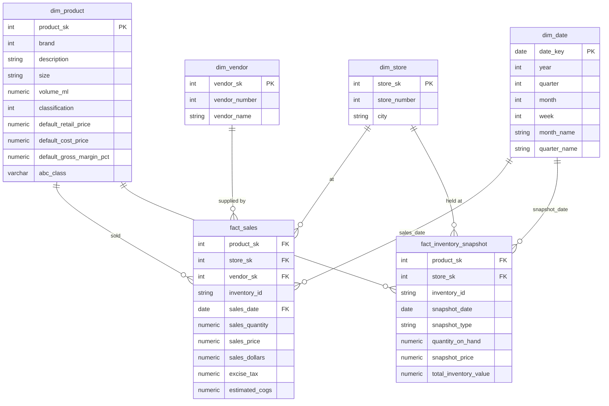
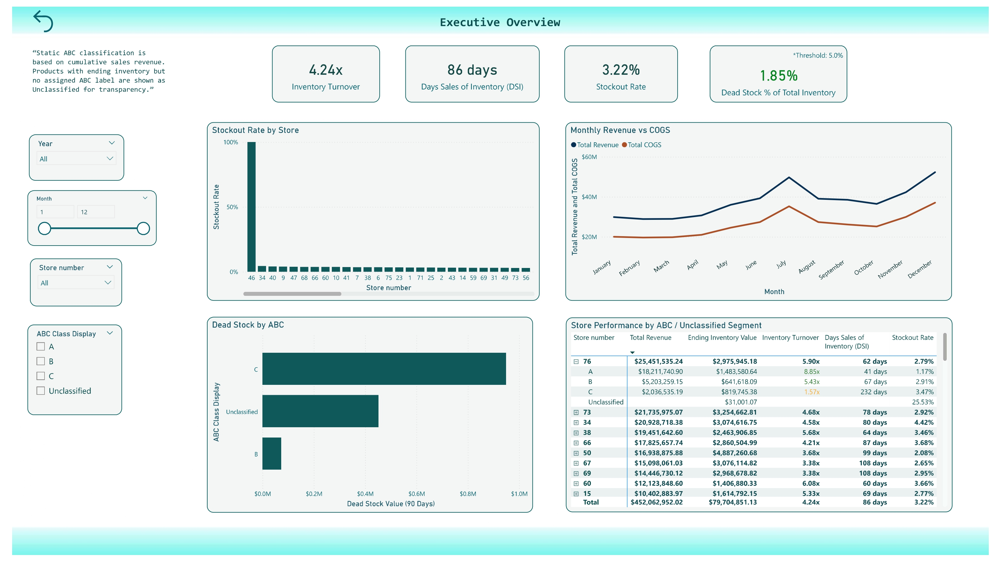
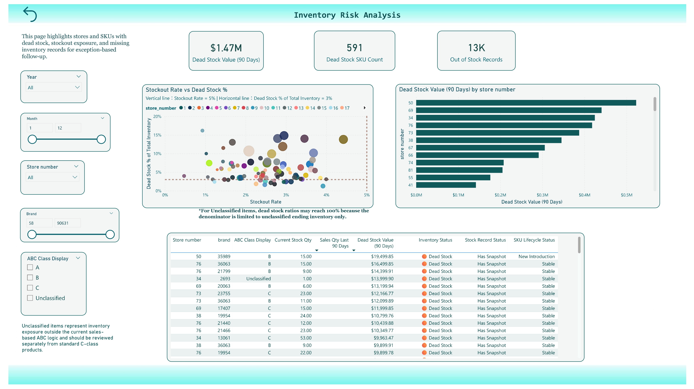
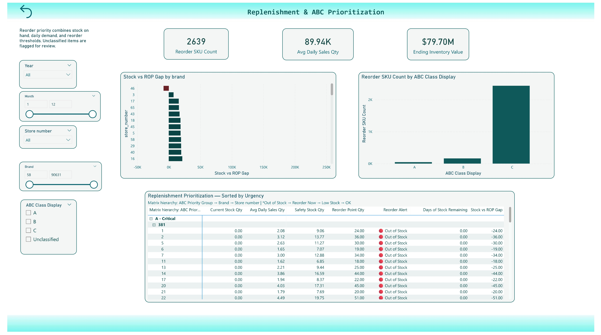

# Inventory Performance Analysis

**PostgreSQL · Power BI · Python · SQL**

---

## Project Overview

This project analyses the full-year 2016 inventory performance of a multi-store liquor
retailer using a real-world dataset from the **PwC × Kaggle Inventory Analysis Case Study**
(~12.8 million sales transactions). Raw CSV data was loaded into **PostgreSQL** via a
Python ELT loader, cleaned through a three-layer architecture (raw → staging → marts),
and visualised in a three-page interactive **Power BI** dashboard.

The goal is to provide data-driven support for **inventory optimisation, dead-stock
reduction, and reorder planning** through structured dimensional modelling, ABC
classification, and KPI analytics.

### Scope

- Load 6 raw CSV files (~12.8 M rows combined) into PostgreSQL via Python (`psycopg2`)
- Execute a full ELT pipeline: raw (TEXT-typed) → staging (type-cast, standardised) → marts (star schema)
- Build a star schema (`dim_product`, `dim_store`, `dim_vendor`, `dim_date` → `fact_sales` + `fact_inventory_snapshot`)
- Implement **Static ABC Classification** in PostgreSQL using window functions to avoid Power BI's 12M-row computation overhead
- Calculate 5 inventory KPIs: Inventory Turnover, DSI, Stockout Rate, Dead Stock %, Reorder Point
- Build a 3-page interactive dashboard in **Power BI** (Import Mode)
- Business insights and actionable recommendations

---

## Dataset

| Item | Description |
|---|---|
| Source | PwC × Kaggle — [Inventory Analysis Case Study](https://www.kaggle.com/bhanupratapbiswas/inventory-analysis-case-study) |
| Full Sales File | [SalesFINAL12312016.csv](https://www.pwc.com/us/en/careers/university_relations/data_analytics_cases_studies/SalesFINAL12312016csv.zip) (12,825,363 rows — download separately) |
| Row Counts | Sales: 12,825,363 / Purchases: 2,372,474 / Beg Inventory: 206,529 / End Inventory: 224,489 |
| Time Range | Full year 2016 (2016-01-01 to 2016-12-31) |
| Stores | 80 stores across multiple cities |
| Products (SKUs) | 12,261 unique brands in `dim_product` |
| Vendors | 132 vendors in `dim_vendor` |
| Key Fields | inventory_id, brand, description, size, store, city, sales_date, sales_quantity, sales_dollars, on_hand, purchase_price |

---

## Tools & Technologies

| Tool | Purpose |
|---|---|
| Python (`psycopg2`, `pandas`, `python-dotenv`) | ELT raw loader — CSV → PostgreSQL `raw` schema |
| PostgreSQL (Standard SQL) | Three-layer ELT, star schema, KPI computation, ABC classification |
| Power BI (Import Mode) | Interactive dashboard & KPI visualisation |
| GitHub | Version control & portfolio documentation |

---

## 1. ELT Pipeline

### Layer 1 — Raw Ingestion (`scripts/01_load_raw.py`)

- Loads all 6 CSV files directly into `raw` schema with **all columns as TEXT** type
- Preserves original data exactly as-is; no transformation at load time
- Uses `psycopg2` with `COPY` for high-performance bulk insert

### Layer 2 — Staging Transformation (`sql/03_staging_transform.sql`)

**Defensive Casting Strategy** — every field uses double `NULLIF` guard:

```sql
CAST(NULLIF(NULLIF(TRIM(sales_quantity), ''), 'Unknown') AS NUMERIC(10,2))
```

| Cleaning Operation | Description |
|---|---|
| Type casting | All TEXT → proper types (NUMERIC, DATE, INTEGER) |
| NULL standardisation | Empty strings and `'Unknown'` values → NULL |
| Vendor name trimming | `TRIM(vendor_name)` — removes trailing whitespace found in source data |
| Gross margin derivation | `(retail_price - purchase_price) / retail_price * 100` computed at staging |
| Carryover invoice flag | `is_carryover_invoice = TRUE` where `invoice_date > 2016-12-31` |
| Post-load row count audit | Row counts validated against raw layer after every INSERT |

### Layer 3 — Marts (Star Schema) (`sql/04_marts_star_schema.sql`)

---

## 2. Data Model (PostgreSQL — Star Schema)

### Schema Diagram



### Table Descriptions

| Table | Type | Description | Design Notes |
|---|---|---|---|
| `dim_product` | Dimension | 12,261 unique SKUs with brand, description, size, pricing | `abc_class` intentionally NULL at creation; back-filled after `fact_sales` via CTE UPDATE |
| `dim_store` | Dimension | 80 stores with city names | City sourced from beg/end inventory; missing from sales table |
| `dim_vendor` | Dimension | 132 vendors consolidated from 4 source tables | UNION of purchases, sales, invoices, and purchase prices |
| `dim_date` | Dimension | Full 2016 calendar (366 days) | Year / Quarter / Month / Week derived fields for Power BI slicers |
| `fact_sales` | Fact | 12,825,363 sales transaction rows | `estimated_cogs = sales_quantity × default_cost_price` |
| `fact_inventory_snapshot` | Fact | BEGINNING + ENDING snapshot rows (431,018 total) | Two `snapshot_type` values enable single-table Turnover/DSI calculation |

---

## 3. ABC Classification Design

> **Portfolio Highlight — Solving a Real Engineering Constraint**

**Problem:** Power BI cannot efficiently compute running-total ABC classification
across 12M rows in Import Mode. DAX `RANKX` + cumulative `CALCULATE` at SKU level
causes report refresh timeouts.

**Solution — Static ABC in PostgreSQL (Two-Phase Approach):**

```sql
-- Phase A: Aggregate revenue per product
-- Phase B: Running cumulative % with window function
-- Phase C: Assign A/B/C label
-- Phase D: Single UPDATE pass back to dim_product

WITH product_revenue AS (
    SELECT product_sk, SUM(sales_dollars) AS total_sales_dollars
    FROM marts.fact_sales GROUP BY product_sk
),
running_total AS (
    SELECT product_sk,
        ROUND(100.0 * SUM(total_sales_dollars) OVER (ORDER BY total_sales_dollars DESC
              ROWS BETWEEN UNBOUNDED PRECEDING AND CURRENT ROW)
              / NULLIF(SUM(total_sales_dollars) OVER (), 0), 4) AS cumulative_pct
    FROM product_revenue
),
abc_labels AS (
    SELECT product_sk,
        CASE WHEN cumulative_pct <= 80 THEN 'A'
             WHEN cumulative_pct <= 95 THEN 'B'
             ELSE 'C' END AS abc_class
    FROM running_total
)
UPDATE marts.dim_product dp
SET abc_class = al.abc_class
FROM abc_labels al WHERE dp.product_sk = al.product_sk;
```

| Class | Threshold | Actual SKU Count | Actual SKU% | Revenue% |
|---|---|---|---|---|
| A | Cumulative ≤ 80% | 1,575 | 12.85% | 80% |
| B | Cumulative ≤ 95% | 2,101 | 17.14% | 15% |
| C | Cumulative > 95% | 7,561 | 61.67% | 5% |
| Unclassified (no sales) | — | 1,024 | 8.35% | — |

---

## 4. KPI Definitions & Results

### KPI Formulas

| KPI | Formula | Source Tables |
|---|---|---|
| **Inventory Turnover** | `COGS / ((Beg Inventory Value + End Inventory Value) / 2)` | `fact_sales`, `fact_inventory_snapshot` |
| **DSI (Days Sales of Inventory)** | `365 / Inventory Turnover` | Derived |
| **Stockout Rate** | `SKU-Store combos with ending on_hand = 0 / Total SKU-Store combos` | `fact_inventory_snapshot` |
| **Dead Stock %** | `SKU-Store with end_qty > 0 AND zero sales in 2016 / Total positions` | `fact_inventory_snapshot`, `fact_sales` |
| **Gross Margin %** | `(Retail Price − Cost Price) / Retail Price × 100` | `dim_product` |

### KPI Summary (2016 Full Year)

| KPI | Value | Benchmark |
|---|---|---|
| Total Revenue | $452,062,952 | — |
| Total COGS (estimated) | $313,385,300 | — |
| Inventory Turnover | **4.24x** | Liquor retail ~4–6x typical ✅ |
| DSI | **86 days** | Lower = more efficient |
| Stockout Rate | **3.22%** | Target < 5% ✅ |
| Dead Stock % | **2.56%** | Target < 10% ✅ |
| Avg Gross Margin (Class A) | **31.69%** | — |

---

## 5. SQL Analysis Pipeline

| SQL File | Purpose | Key Operations |
|---|---|---|
| `00_schema_setup.sql` | Schema & raw table DDL | Creates `raw`, `staging`, `marts` schemas; all raw columns TEXT |
| `01_raw_columns_check.sql` | Column header audit | Verifies actual column names against expectations |
| `02_validate_raw.sql` | 7-section raw data QA | NULL checks, business rules, date range, duplicate detection, referential integrity |
| `03_staging_transform.sql` | Staging layer ELT | Defensive casting, NULL standardisation, gross margin derivation, row count audit |
| `04_marts_star_schema.sql` | Star schema + ABC | Dim/Fact creation with surrogate keys; 4-phase static ABC classification |
| `05_marts_dim_date.sql` | Date dimension | Full 2016 calendar with Year/Quarter/Month/Week attributes |
| `analysis/A. overview & Inventory Turnover & DSI.sql` | KPI baseline analysis | Table row counts, revenue summary, and Turnover/DSI calculation |
| `analysis/B. Stockout Rate & Overstock (Dead Stock).sql` | Inventory health | Stockout rate and dead stock % by SKU-store position |
| `analysis/C. ABC Classification Distribution.sql` | ABC breakdown | SKU count, SKU%, and avg gross margin by A/B/C class |
| `analysis/D. Top Vendors & Monthly Sales Trend.sql` | Commercial analysis | Top 10 vendors by revenue; monthly revenue and active-SKU trend |

### Data Validation Highlights (`02_validate_raw.sql`)

| Check | Finding |
|---|---|
| NULL primary keys | 0 NULL `inventory_id` across all tables |
| Negative quantities / dollars | 0 rows in `raw_sales` |
| Price calc mismatch (`raw_purchase_prices`) | 12,260 rows where retail price ≠ purchase price (expected — margin spread) |
| Date out-of-range | Sales: 0 rows outside 2016; Invoice purchases: 140 carryover rows (flagged & retained) |
| Referential integrity | 64,044 sales inventory_ids not in beg inventory; 50,368 not in end inventory (new products launched mid-year — expected) |
| Vendor trailing whitespace | Found in 20+ vendors; resolved via `TRIM(vendor_name)` in staging |

---

## 6. Power BI Dashboard (3 Pages)

### Page 1: Inventory Overview


- **KPI Cards**: Total Revenue ($452M), Inventory Turnover (4.24x), DSI (86 days), Stockout Rate (3.22%)
- **Monthly Revenue Trend**: Full-year 2016 sales trend by month (peak: Dec $52.3M; trough: Feb $28.9M)
- **Top 10 Stores Bar Chart**: Revenue ranking across 80 stores (top store: Doncaster #76, $25.5M)
- **ABC Class Donut**: SKU distribution — A: 12.85% / B: 17.14% / C: 61.67% / Unclassified: 8.35%

### Page 2: ABC & Product Analysis


- **ABC Classification Table**: Product-level revenue, quantity, and class breakdown
- **Top SKU Revenue Bar Chart**: Highest-revenue products with gross margin overlay
- **Gross Margin Distribution**: Class A avg 31.69%; Class B avg 33.28%; Class C avg 33.81%
- **Vendor Performance Matrix**: Revenue and SKU count per vendor (top: Diageo $68.7M, 415 SKUs)

### Page 3: Inventory Health


- **Stockout Map / Table**: 7,230 SKU-store positions with zero ending inventory (3.22% of 224,489 positions)
- **Dead Stock Analysis**: 5,755 SKU-store positions hold inventory with zero 2016 sales (77,785 units stranded)
- **Beginning vs Ending Inventory**: Beg value $68.1M → End value $79.7M (+17.1% growth)
- **Reorder Point Reference**: Products approaching reorder threshold

Dashboard PDF export: [`powerbi/dashboard.pdf`](./powerbi/dashboard.pdf)

---

## Key Findings

### Inventory KPIs

| Metric | Value | Insight |
|---|---|---|
| Inventory Turnover | 4.24x | Within benchmark range (4–6x) for liquor retail; slight room for improvement |
| DSI | 86 days | ~3 months of stock on hand; C-class SKUs likely dragging this higher |
| Stockout Rate | 3.22% | Below 5% target — healthy supply coverage overall |
| Dead Stock % | 2.56% | 5,755 positions / 77,785 units with zero 2016 sales; capital tied up unnecessarily |

### ABC Classification

| Class | SKU Count | SKU% | Avg Gross Margin% | Revenue Contribution |
|---|---|---|---|---|
| A | 1,575 | 12.85% | 31.69% | 80% |
| B | 2,101 | 17.14% | 33.28% | 15% |
| C | 7,561 | 61.67% | 33.81% | 5% |
| Unclassified | 1,024 | 8.35% | 32.74% | — |

### Top 5 Revenue Products (Class A)

| Rank | Product | Revenue | Avg Selling Price |
|---|---|---|---|
| 1 | Jack Daniels No 7 Black | $5,101,920 | $36.23 |
| 2 | Tito's Handmade Vodka | $4,819,073 | $30.31 |
| 3 | Absolut 80 Proof | $4,538,121 | $24.48 |
| 4 | Capt Morgan Spiced Rum | $4,475,973 | $22.83 |
| 5 | Ketel One Vodka | $4,223,108 | $31.42 |

### Top 5 Vendors by Revenue

| Rank | Vendor | Revenue | SKU Count |
|---|---|---|---|
| 1 | DIAGEO NORTH AMERICA INC | $68,742,417 | 415 |
| 2 | MARTIGNETTI COMPANIES | $41,047,306 | 1,495 |
| 3 | PERNOD RICARD USA | $32,281,248 | 254 |
| 4 | JIM BEAM BRANDS COMPANY | $31,906,321 | 389 |
| 5 | BACARDI USA INC | $25,014,557 | 171 |

---

## Business Recommendations

1. **Protect Class A SKU availability — especially top 5 products** — 1,575 SKUs (12.85% of catalogue) generate 80% of $452M revenue. Jack Daniels No 7 ($5.1M) and Tito's Vodka ($4.8M) alone represent over 2% of total revenue each. A single week of stockout on these items costs an estimated $98K–$130K in lost sales. Implement automated reorder triggers at 2× average weekly velocity.

2. **Clear 77,785 units of dead stock through promotions or vendor returns** — 5,755 SKU-store positions (2.56%) hold unsold inventory as of year-end. At an average cost price implied by the 31–34% margin structure, this represents approximately $1.5–2M in tied-up working capital. Prioritise 20–30% clearance discounts for C-class dead stock; negotiate vendor credit for A/B-class overstock.

3. **Reduce DSI from 86 days toward the 60–70 day range** — the current 86-day DSI is above the efficient liquor retail target. With ending inventory at $79.7M (+17.1% vs beginning), inventory growth outpaced sales growth. Focus purchase order reductions on the 7,561 C-class SKUs, which contribute only 5% of revenue but represent 61.67% of the product catalogue.

4. **Consolidate the long tail of C-class vendors** — 132 active vendors supply 12,261 SKUs, but Diageo and Martignetti together account for $109.8M (24.3% of total revenue). The top 10 vendors collectively cover the majority of Class A revenue. Rationalising the bottom 50+ vendors — who collectively supply low-velocity C-class SKUs — would reduce procurement overhead and improve negotiation leverage with strategic partners.

5. **Investigate seasonal demand and pre-position stock ahead of peak months** — December ($52.3M) and July ($49.7M) are the two highest-revenue months, together representing 22.6% of annual sales. February ($28.9M) is the annual trough. A forward-buying strategy in November and June for Class A SKUs, combined with purchase freezes in January for C-class items, would reduce DSI while protecting availability during peaks.

6. **Monitor the 3.22% stockout rate at store level** — while the aggregate rate is within target, Doncaster stores #76 and #73 (top 2 by revenue at $25.5M and $21.7M) likely have disproportionate impact if stocked out. Store-level drill-down in the Power BI Inventory Health page enables targeted replenishment prioritisation.

---

## Data Engineering Notes

### Handling the 12.8M Row Sales File

The full `SalesFINAL12312016.csv` contains **12,825,363 rows** but standard tools (Excel, pgAdmin import wizard) cap at ~1M rows. This project resolves this using a Python `psycopg2` bulk loader with chunked reads:

```python
# scripts/01_load_raw.py
for chunk in pd.read_csv(filepath, chunksize=100_000, dtype=str):
    # Stream directly into PostgreSQL raw schema
```

The full file must be downloaded from the [PwC source](https://www.pwc.com/us/en/careers/university_relations/data_analytics_cases_studies/SalesFINAL12312016csv.zip) and placed in `data/raw/` before running the loader.

---

## How to Reproduce

**Prerequisites**: Python 3.8+, PostgreSQL 14+, Power BI Desktop

1. Download raw data files from [Kaggle](https://www.kaggle.com/bhanupratapbiswas/inventory-analysis-case-study) + [PwC full sales file](https://www.pwc.com/us/en/careers/university_relations/data_analytics_cases_studies/SalesFINAL12312016csv.zip), place in `data/raw/`
2. Install dependencies
   ```bash
   pip install pandas sqlalchemy psycopg2-binary python-dotenv
   ```
3. Configure database connection
   ```bash
   cp .env.example .env
   # Edit .env with your PostgreSQL credentials
   ```
4. Run ELT pipeline in order:
   ```bash
   # Step 1: Create schemas & raw tables
   psql -f sql/00_schema_setup.sql

   # Step 2: Load raw CSVs into PostgreSQL
   python scripts/01_load_raw.py

   # Step 3: Validate raw data
   psql -f sql/02_validate_raw.sql

   # Step 4: Staging transformation
   psql -f sql/03_staging_transform.sql

   # Step 5: Build star schema + ABC classification
   psql -f sql/04_marts_star_schema.sql

   # Step 6: Build date dimension
   psql -f sql/05_marts_dim_date.sql
   ```
5. Run KPI analysis queries (optional — outputs already in `output/analysis/`):
   ```bash
   psql -f "sql/analysis/A. overview & Inventory Turnover & DSI.sql"
   psql -f "sql/analysis/B. Stockout Rate & Overstock (Dead Stock).sql"
   psql -f "sql/analysis/C. ABC Classification Distribution.sql"
   psql -f "sql/analysis/D. Top Vendors & Monthly Sales Trend.sql"
   ```
6. Open Power BI Desktop, connect to PostgreSQL `marts` schema, refresh data

---

## Project Structure
```
04_Inventory_Performance_Analysis/
├── README.md
├── data/
│   ├── raw/                          # Full CSVs (gitignored — not committed)
│   └── raw_review/                   # 100-row preview of each source file
├── scripts/
│   └── 01_load_raw.py                # Python bulk loader (CSV → raw schema)
├── sql/
│   ├── 00_schema_setup.sql           # Schema creation & raw table DDL
│   ├── 01_raw_columns_check.sql      # Column header audit
│   ├── 02_validate_raw.sql           # 7-section raw data validation
│   ├── 03_staging_transform.sql      # Staging ELT (type casting, NULL handling)
│   ├── 04_marts_star_schema.sql      # Star schema + static ABC classification
│   ├── 05_marts_dim_date.sql         # Date dimension
│   └── analysis/                     # KPI & business analysis queries
├── output/
│   ├── mart_review/                  # 100-row previews of mart tables
│   ├── sql.02_validate_raw/          # Validation query outputs (CSV)
│   └── analysis/                     # KPI analysis query outputs (CSV)
├── powerbi/
│   ├── dashboard.pdf                 # Dashboard PDF export
│   └── screenshots/                  # Page1.png / Page2.png / Page3.png
├── powerbi_design.ipynb              # Power BI design specifications & DAX
├── log.ipynb                         # Development log & engineering decisions
├── .env.example                      # Database connection template
└── LICENSE
```

---

## Author

Ross Tang | [GitHub](https://github.com/ross-bi)

## License

This project is licensed under the [MIT License](./LICENSE).
