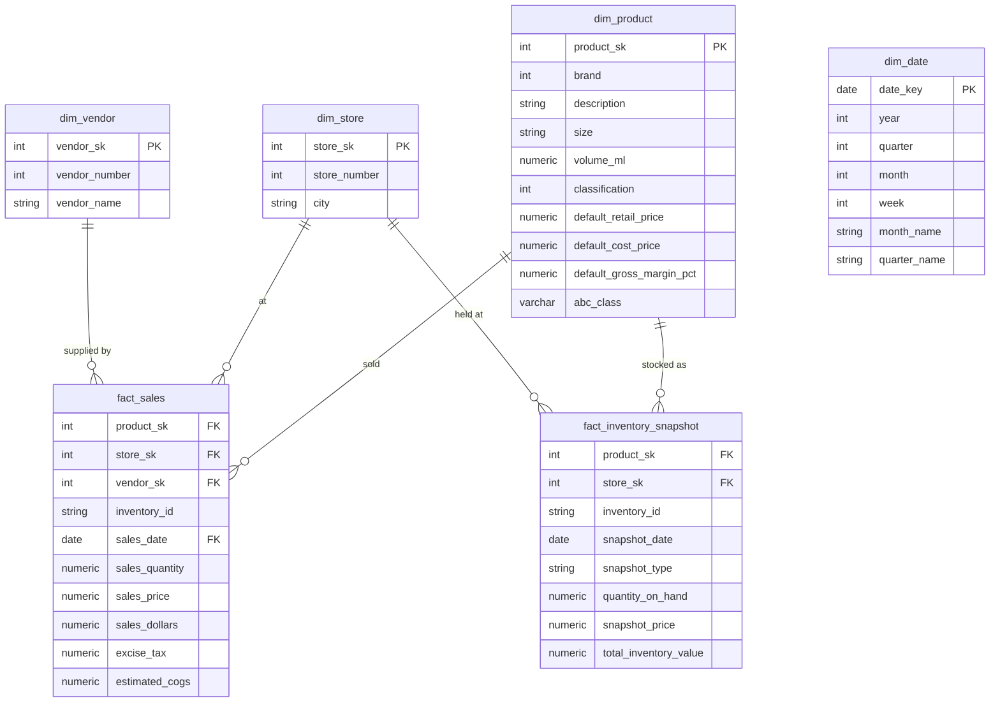

# Inventory Performance Analysis

**PostgreSQL · Power BI · Python · SQL**

---

## Project Overview

This project analyses the full-year 2016 inventory performance of a multi-store liquor
retailer using a real-world dataset from the **PwC × Kaggle Inventory Analysis Case Study**
(~12.8 million sales transactions). Raw CSV data was loaded into **PostgreSQL** via a
Python ELT loader, cleaned through a three-layer architecture (raw → staging → marts),
and visualised in a three-page interactive **Power BI** dashboard.

The goal is to provide data-driven support for **inventory optimisation, dead-stock
reduction, and reorder planning** through structured dimensional modelling, ABC
classification, and KPI analytics.

### Scope

- Load 6 raw CSV files (~12.8 M rows combined) into PostgreSQL via Python (`psycopg2`)
- Execute a full ELT pipeline: raw (TEXT-typed) → staging (type-cast, standardised) → marts (star schema)
- Build a star schema (`dim_product`, `dim_store`, `dim_vendor`, `dim_date` → `fact_sales` + `fact_inventory_snapshot`)
- Implement **Static ABC Classification** in PostgreSQL using window functions to avoid Power BI's 12M-row computation overhead
- Calculate 5 inventory KPIs: Inventory Turnover, DSI, Stockout Rate, Dead Stock %, Reorder Point
- Build a 3-page interactive dashboard in **Power BI** (Import Mode)
- Business insights and actionable recommendations

---

## Dataset

| Item | Description |
|---|---|
| Source | PwC × Kaggle — [Inventory Analysis Case Study](https://www.kaggle.com/bhanupratapbiswas/inventory-analysis-case-study) |
| Full Sales File | [SalesFINAL12312016.csv](https://www.pwc.com/us/en/careers/university_relations/data_analytics_cases_studies/SalesFINAL12312016csv.zip) (12,825,363 rows — download separately) |
| Row Counts | Sales: ~1,048,575 (loaded subset) / Purchases: [XXX] / Beg Inventory: [XXX] / End Inventory: [XXX] |
| Time Range | Full year 2016 (2016-01-01 to 2016-12-31) |
| Stores | [XXX] stores across multiple cities |
| Products (SKUs) | [XXX] unique brands in `dim_product` |
| Vendors | [XXX] vendors in `dim_vendor` |
| Key Fields | inventory_id, brand, description, size, store, city, sales_date, sales_quantity, sales_dollars, on_hand, purchase_price |

---

## Tools & Technologies

| Tool | Purpose |
|---|---|
| Python (`psycopg2`, `pandas`, `python-dotenv`) | ELT raw loader — CSV → PostgreSQL `raw` schema |
| PostgreSQL (Standard SQL) | Three-layer ELT, star schema, KPI computation, ABC classification |
| Power BI (Import Mode) | Interactive dashboard & KPI visualisation |
| GitHub | Version control & portfolio documentation |

---

## 1. ELT Pipeline

### Layer 1 — Raw Ingestion (`scripts/01_load_raw.py`)

- Loads all 6 CSV files directly into `raw` schema with **all columns as TEXT** type
- Preserves original data exactly as-is; no transformation at load time
- Uses `psycopg2` with `COPY` for high-performance bulk insert

### Layer 2 — Staging Transformation (`sql/03_staging_transform.sql`)

**Defensive Casting Strategy** — every field uses double `NULLIF` guard:

```sql
CAST(NULLIF(NULLIF(TRIM(sales_quantity), ''), 'Unknown') AS NUMERIC(10,2))
```

| Cleaning Operation | Description |
|---|---|
| Type casting | All TEXT → proper types (NUMERIC, DATE, INTEGER) |
| NULL standardisation | Empty strings and `'Unknown'` values → NULL |
| Vendor name trimming | `TRIM(vendor_name)` — removes trailing whitespace found in source data |
| Gross margin derivation | `(retail_price - purchase_price) / retail_price * 100` computed at staging |
| Carryover invoice flag | `is_carryover_invoice = TRUE` where `invoice_date > 2016-12-31` |
| Post-load row count audit | Row counts validated against raw layer after every INSERT |

### Layer 3 — Marts (Star Schema) (`sql/04_marts_star_schema.sql`)

---

## 2. Data Model (PostgreSQL — Star Schema)

### Schema Diagram



### Table Descriptions

| Table | Type | Description | Design Notes |
|---|---|---|---|
| `dim_product` | Dimension | [XXX] unique SKUs with brand, description, size, pricing | `abc_class` intentionally NULL at creation; back-filled after `fact_sales` via CTE UPDATE |
| `dim_store` | Dimension | [XXX] stores with city names | City sourced from beg/end inventory; missing from sales table |
| `dim_vendor` | Dimension | [XXX] vendors consolidated from 4 source tables | UNION of purchases, sales, invoices, and purchase prices |
| `dim_date` | Dimension | Full 2016 calendar (366 days) | Year / Quarter / Month / Week derived fields for Power BI slicers |
| `fact_sales` | Fact | ~1M sales transaction rows | `estimated_cogs = sales_quantity × default_cost_price` |
| `fact_inventory_snapshot` | Fact | BEGINNING + ENDING snapshot rows | Two `snapshot_type` values enable single-table Turnover/DSI calculation |

---

## 3. ABC Classification Design

> **Portfolio Highlight — Solving a Real Engineering Constraint**

**Problem:** Power BI cannot efficiently compute running-total ABC classification
across 12M rows in Import Mode. DAX `RANKX` + cumulative `CALCULATE` at SKU level
causes report refresh timeouts.

**Solution — Static ABC in PostgreSQL (Two-Phase Approach):**

```sql
-- Phase A: Aggregate revenue per product
-- Phase B: Running cumulative % with window function
-- Phase C: Assign A/B/C label
-- Phase D: Single UPDATE pass back to dim_product

WITH product_revenue AS (
    SELECT product_sk, SUM(sales_dollars) AS total_sales_dollars
    FROM marts.fact_sales GROUP BY product_sk
),
running_total AS (
    SELECT product_sk,
        ROUND(100.0 * SUM(total_sales_dollars) OVER (ORDER BY total_sales_dollars DESC
              ROWS BETWEEN UNBOUNDED PRECEDING AND CURRENT ROW)
              / NULLIF(SUM(total_sales_dollars) OVER (), 0), 4) AS cumulative_pct
    FROM product_revenue
),
abc_labels AS (
    SELECT product_sk,
        CASE WHEN cumulative_pct <= 80 THEN 'A'
             WHEN cumulative_pct <= 95 THEN 'B'
             ELSE 'C' END AS abc_class
    FROM running_total
)
UPDATE marts.dim_product dp
SET abc_class = al.abc_class
FROM abc_labels al WHERE dp.product_sk = al.product_sk;
```

| Class | Threshold | Expected SKU% | Revenue% |
|---|---|---|---|
| A | Cumulative ≤ 80% | ~10–20% of SKUs | 80% of revenue |
| B | Cumulative ≤ 95% | ~20–30% of SKUs | next 15% |
| C | Cumulative > 95% | ~50–70% of SKUs | tail 5% |

---

## 4. KPI Definitions & Results

### KPI Formulas

| KPI | Formula | Source Tables |
|---|---|---|
| **Inventory Turnover** | `COGS / ((Beg Inventory Value + End Inventory Value) / 2)` | `fact_sales`, `fact_inventory_snapshot` |
| **DSI (Days Sales of Inventory)** | `365 / Inventory Turnover` | Derived |
| **Stockout Rate** | `SKU-Store combos with ending on_hand = 0 / Total SKU-Store combos` | `fact_inventory_snapshot` |
| **Dead Stock %** | `SKU-Store with end_qty > 0 AND zero sales in 2016 / Total positions` | `fact_inventory_snapshot`, `fact_sales` |
| **Gross Margin %** | `(Retail Price − Cost Price) / Retail Price × 100` | `dim_product` |

### KPI Summary (2016 Full Year)

| KPI | Value | Benchmark |
|---|---|---|
| Total Revenue | $[XXX] | — |
| Total COGS (estimated) | $[XXX] | — |
| Inventory Turnover | [XXX]x | Liquor retail ~4–6x typical |
| DSI | [XXX] days | Lower = more efficient |
| Stockout Rate | [XXX]% | Target < 5% |
| Dead Stock % | [XXX]% | Target < 10% |
| Avg Gross Margin | ~24–28% | — |

---

## 5. SQL Analysis Pipeline

| SQL File | Purpose | Key Operations |
|---|---|---|
| `00_schema_setup.sql` | Schema & raw table DDL | Creates `raw`, `staging`, `marts` schemas; all raw columns TEXT |
| `01_raw_columns_check.sql` | Column header audit | Verifies actual column names against expectations |
| `02_validate_raw.sql` | 7-section raw data QA | NULL checks, business rules, date range, duplicate detection, referential integrity |
| `03_staging_transform.sql` | Staging layer ELT | Defensive casting, NULL standardisation, gross margin derivation, row count audit |
| `04_marts_star_schema.sql` | Star schema + ABC | Dim/Fact creation with surrogate keys; 4-phase static ABC classification |
| `05_marts_dim_date.sql` | Date dimension | Full 2016 calendar with Year/Quarter/Month/Week attributes |

### Data Validation Highlights (`02_validate_raw.sql`)

| Check | Finding |
|---|---|
| NULL primary keys | 0 NULL `inventory_id` across all tables |
| Negative quantities | [XXX] rows flagged in `raw_sales` |
| Price calc mismatch | `SalesDollars ≠ SalesQuantity × SalesPrice` (tolerance $0.02): [XXX] rows |
| Date out-of-range | Sales: [XXX] rows outside 2016 |
| Duplicate transactions | [XXX] duplicate (inventory_id, date, qty) groups |
| Vendor trailing whitespace | Found & resolved via `TRIM(vendor_name)` in staging |

---

## 6. Power BI Dashboard (3 Pages)

### Page 1: Inventory Overview


- **KPI Cards**: Total Revenue, Inventory Turnover, DSI, Stockout Rate
- **Monthly Revenue Trend**: Full-year 2016 sales trend by month
- **Top 10 Stores Bar Chart**: Revenue ranking across [XXX] stores
- **ABC Class Donut**: SKU distribution across A / B / C categories

### Page 2: ABC & Product Analysis


- **ABC Classification Table**: Product-level revenue, quantity, and class breakdown
- **Top SKU Revenue Bar Chart**: Highest-revenue products with gross margin overlay
- **Gross Margin Distribution**: Margin spread across product classifications
- **Vendor Performance Matrix**: Revenue and SKU count per vendor

### Page 3: Inventory Health


- **Stockout Map / Table**: Stores and SKUs with zero ending inventory
- **Dead Stock Analysis**: SKU-store positions with inventory but no 2016 sales
- **Beginning vs Ending Inventory**: Value comparison by product category
- **Reorder Point Reference**: Products approaching reorder threshold

Dashboard PDF export: [`powerbi/dashboard.pdf`](./powerbi/dashboard.pdf)

---

## Key Findings

### Inventory KPIs

| Metric | Value | Insight |
|---|---|---|
| Inventory Turnover | [XXX]x | [Pending query result] |
| DSI | [XXX] days | [Pending query result] |
| Stockout Rate | [XXX]% | [Pending query result] |
| Dead Stock % | [XXX]% | [Pending query result] |

### ABC Classification

| Class | SKU Count | SKU% | Revenue Contribution |
|---|---|---|---|
| A | [XXX] | [XXX]% | 80% |
| B | [XXX] | [XXX]% | 15% |
| C | [XXX] | [XXX]% | 5% |

### Top 5 Revenue Products (Class A)

| Rank | Product | Revenue | Avg Margin% |
|---|---|---|---|
| 1 | [XXX] | $[XXX] | [XXX]% |
| 2 | [XXX] | $[XXX] | [XXX]% |
| 3 | [XXX] | $[XXX] | [XXX]% |

### Top 5 Vendors by Revenue

| Rank | Vendor | Revenue | SKU Count |
|---|---|---|---|
| 1 | [XXX] | $[XXX] | [XXX] |
| 2 | [XXX] | $[XXX] | [XXX] |

---

## Business Recommendations

1. **Prioritise Class A SKU replenishment** — [XXX]% of SKUs drive 80% of revenue; stockouts in this tier directly impact top-line performance; implement automated reorder triggers at 2× average weekly sales lead time
2. **Liquidate or discount Class C dead stock** — [XXX]% of SKU-store positions hold inventory with zero 2016 sales; carrying cost erodes margin; recommend 20–30% clearance promotions or vendor return negotiations
3. **Reduce DSI below [XXX] days** — current DSI of [XXX] days suggests over-ordering relative to demand velocity; tighten purchase quantities for C-class SKUs with high on-hand balances
4. **Investigate stockout root causes by store** — [XXX]% stockout rate varies significantly across stores; cross-reference with purchase lead times to identify whether stockouts are demand-driven or supply-chain-driven
5. **Standardise vendor consolidation** — [XXX] active vendors for [XXX] SKUs indicates fragmented sourcing; consolidating to top 20 vendors (who supply the majority of Class A SKUs) could improve purchasing leverage and reduce logistics complexity

---

## Data Engineering Notes

### Handling the 12.8M Row Sales File

The full `SalesFINAL12312016.csv` contains **12,825,363 rows** but standard tools (Excel, pgAdmin import wizard) cap at ~1M rows. This project resolves this using a Python `psycopg2` bulk loader with chunked reads:

```python
# scripts/01_load_raw.py
for chunk in pd.read_csv(filepath, chunksize=100_000, dtype=str):
    # Stream directly into PostgreSQL raw schema
```

The full file must be downloaded from the [PwC source](https://www.pwc.com/us/en/careers/university_relations/data_analytics_cases_studies/SalesFINAL12312016csv.zip) and placed in `data/raw/` before running the loader.

---

## How to Reproduce

**Prerequisites**: Python 3.8+, PostgreSQL 14+, Power BI Desktop

1. Download raw data files from [Kaggle](https://www.kaggle.com/bhanupratapbiswas/inventory-analysis-case-study) + [PwC full sales file](https://www.pwc.com/us/en/careers/university_relations/data_analytics_cases_studies/SalesFINAL12312016csv.zip), place in `data/raw/`
2. Install dependencies
   ```bash
   pip install pandas sqlalchemy psycopg2-binary python-dotenv
   ```
3. Configure database connection
   ```bash
   cp .env.example .env
   # Edit .env with your PostgreSQL credentials
   ```
4. Run ELT pipeline in order:
   ```bash
   # Step 1: Create schemas & raw tables
   psql -f sql/00_schema_setup.sql

   # Step 2: Load raw CSVs into PostgreSQL
   python scripts/01_load_raw.py

   # Step 3: Validate raw data
   psql -f sql/02_validate_raw.sql

   # Step 4: Staging transformation
   psql -f sql/03_staging_transform.sql

   # Step 5: Build star schema + ABC classification
   psql -f sql/04_marts_star_schema.sql

   # Step 6: Build date dimension
   psql -f sql/05_marts_dim_date.sql
   ```
5. Open Power BI Desktop, connect to PostgreSQL `marts` schema, refresh data

---

## Project Structure
```
04_Inventory_Performance_Analysis/
├── README.md
├── data/
│ ├── raw/ # Full CSVs (gitignored — not committed)
│ └── raw_review/ # 100-row preview of each source file
├── scripts/
│ └── 01_load_raw.py # Python bulk loader (CSV → raw schema)
├── sql/
│ ├── 00_schema_setup.sql # Schema creation & raw table DDL
│ ├── 01_raw_columns_check.sql # Column header audit
│ ├── 02_validate_raw.sql # 7-section raw data validation
│ ├── 03_staging_transform.sql # Staging ELT (type casting, NULL handling)
│ ├── 04_marts_star_schema.sql # Star schema + static ABC classification
│ └── 05_marts_dim_date.sql # Date dimension
├── output/
│ ├── mart_review/ # 100-row previews of mart tables
│ └── sql.02_validate_raw/ # Validation query outputs
├── powerbi/
│ ├── dashboard.pdf # Dashboard PDF export
│ └── screenshots/ # Page1.png / Page2.png / Page3.png
├── powerbi_design.ipynb # Power BI design specifications & DAX
├── log.ipynb # Development log & engineering decisions
├── .env.example # Database connection template
└── LICENSE
```

---

## Author

Ross Tang | [GitHub](https://github.com/ross-bi)

## License

This project is licensed under the [MIT License](./LICENSE).