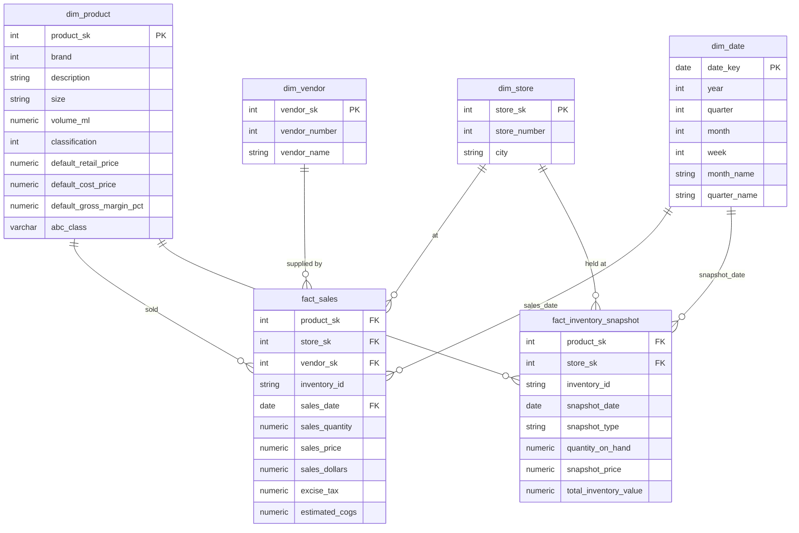

[](README.md)
&nbsp;&nbsp;
[](README.zh-TW.md)


# 库存绩效分析

**PostgreSQL · Power BI · Python · SQL**

---

## 专案概述

本项目以 **PwC × Kaggle 库存分析案例**（约 1,280 万笔销售交易）的真实数据集，分析一家多门市酒类零售商 2016 年全年的库存绩效。原始 CSV 数据透过 Python ELT Loader 加载 **PostgreSQL**，经三层架构清洗（raw → staging → marts），最终于三页交互式 **Power BI** 仪表板中呈现。

目标是透过结构化维度建模、ABC 分类与 KPI 分析，为**库存优化、死库存减少与补货规划**提供数据驱动的决策支持。

### 项目范围

- 透过 Python（`psycopg2`）将 6 个原始 CSV 档（合计约 1,280 万笔）载入 PostgreSQL
- 执行完整 ELT 流程：raw（全 TEXT 型态）→ staging（型别转换、标准化）→ marts（星型结构）
- 建立星型结构（`dim_product`、`dim_store`、`dim_vendor`、`dim_date` → `fact_sales` + `fact_inventory_snapshot`）
- 在 PostgreSQL 以窗口函数实作**静态 ABC 分类**，避免 Power BI Import Mode 处理 1,200 万笔时的计算逾时
- 计算 5 个库存 KPI：Inventory Turnover、DSI、Stockout Rate、Dead Stock %、Reorder Point
- 在 **Power BI**（Import Mode）建立 3 页交互式仪表板
- 业务洞察与可执行建议

---

## 数据集

| 项目 | 说明 |
|---|---|
| 来源 | PwC × Kaggle — [Inventory Analysis Case Study](https://www.kaggle.com/bhanupratapbiswas/inventory-analysis-case-study) |
| 完整销售档案 | [SalesFINAL12312016.csv](https://www.pwc.com/us/en/careers/university_relations/data_analytics_cases_studies/SalesFINAL12312016csv.zip)（12,825,363 笔 — 需另行下载） |
| 各表笔数 | 销售：12,825,363 / 进货：2,372,474 / 期初库存：206,529 / 期末库存：224,489 |
| 时间范围 | 2016 年全年（2016-01-01 至 2016-12-31） |
| 门市数量 | 80 家门市，分布于多个城市 |
| 商品（SKU）数量 | `dim_product` 中 12,261 个唯一品牌 |
| 供货商数量 | `dim_vendor` 中 132 家供货商 |
| 主要字段 | inventory_id、brand、description、size、store、city、sales_date、sales_quantity、sales_dollars、on_hand、purchase_price |

---

## 工具与技术

| 工具 | 用途 |
|---|---|
| Python（`psycopg2`、`pandas`、`python-dotenv`） | ELT 原始数据加载 — CSV → PostgreSQL `raw` schema |
| PostgreSQL（标准 SQL） | 三层 ELT、星型结构、KPI 计算、ABC 分类 |
| Power BI（Import Mode） | 交互式仪表板与 KPI 可视化 |
| GitHub | 版本控管与作品集文件 |

---

## 1. ELT 流程

### 第一层 — 原始数据加载（`scripts/01_load_raw.py`）

- 将全部 6 个 CSV 文件以**全 TEXT 型态**加载 `raw` schema
- 完整保留原始数据，加载时不做任何转换
- 使用 `psycopg2` 的 `COPY` 指令进行高效能批次汇入

### 第二层 — Staging 转换（`sql/03_staging_transform.sql`）

**防御性转型策略** — 每个字段均使用双重 `NULLIF` 防护：

```sql
CAST(NULLIF(NULLIF(TRIM(sales_quantity), ''), 'Unknown') AS NUMERIC(10,2))
```

| 清洗操作 | 说明 |
|---|---|
| 型别转换 | 全部 TEXT → 适当型别（NUMERIC、DATE、INTEGER） |
| NULL 标准化 | 空字符串与 `'Unknown'` 值 → NULL |
| 供货商名称去空白 | `TRIM(vendor_name)` — 移除源数据中的尾端空白 |
| 毛利率计算 | `(retail_price - purchase_price) / retail_price * 100`，于 staging 层衍生 |
| 跨年发票标记 | `is_carryover_invoice = TRUE`（invoice_date > 2016-12-31 者） |
| 载入后笔数稽核 | 每次 INSERT 后与 raw 层比对笔数 |


### 第三层 — Marts（星型结构）（`sql/04_marts_star_schema.sql`）

**建立顺序：**`dim_vendor` → `dim_store` → `dim_product` → `fact_sales` → `fact_inventory_snapshot` → ABC Classification UPDATE → `dim_date`

| Step | Object | Source Tables | Key Operations |
|---|---|---|---|
| 1 | `dim_vendor` | `stg_purchases`, `stg_sales`, `stg_invoice_purchases`, `stg_purchase_prices` | UNION of 4 staging tables; `ROW_NUMBER()` generates `vendor_sk`; `MAX(vendor_name)` resolves duplicates |
| 2 | `dim_store` | `stg_beg_inventory`, `stg_end_inventory`, `stg_sales` | UNION of 3 tables; city sourced from inventory tables (sales table has no city); `ROW_NUMBER()` generates `store_sk` |
| 3 | `dim_product` | `stg_purchase_prices`, `stg_sales` | `FULL OUTER JOIN` to capture all SKUs; `abc_class` intentionally `NULL` at creation — back-filled in Step 6 |
| 4 | `fact_sales` | `stg_sales` + 3 dim joins | `estimated_cogs = sales_quantity × default_cost_price`; 12,825,363 rows |
| 5 | `fact_inventory_snapshot` | `stg_beg_inventory`, `stg_end_inventory` | `UNION ALL` of BEGINNING + ENDING rows; `snapshot_type` column enables single-table Turnover/DSI calculation; 431,018 rows |
| 6 | ABC UPDATE | `fact_sales` → `dim_product` | 4-phase CTE: aggregate revenue → cumulative % → assign A/B/C → `UPDATE dim_product` in one pass |
| 7 | `dim_date` | `fact_sales` (date range) | `generate_series(MIN(sales_date), MAX(sales_date))` — full 2016 calendar (366 days); adds `quarter`, `month_name`, `week_of_year`, `is_weekend` |

**索引策略：**

| Index | Column | Purpose |
|---|---|---|
| `idx_dim_vendor_sk` (UNIQUE) | `vendor_sk` | PK lookup |
| `idx_dim_store_sk` (UNIQUE) | `store_sk` | PK lookup |
| `idx_dim_product_sk` (UNIQUE) | `product_sk` | PK lookup |
| `idx_dim_product_brand` | `brand` | Staging JOIN key |
| `idx_fact_sales_product_sk` | `product_sk` | FK join to `dim_product` |
| `idx_fact_sales_date` | `sales_date` | Date range filter & `dim_date` join |
| `idx_fact_inv_product_sk` | `product_sk` | FK join to `dim_product` |
| `idx_fact_inv_date` | `snapshot_date` | Date filter & `dim_date` join |
| `idx_dim_date_key` (UNIQUE) | `date_key` | PK lookup |

> **Design Note — `dim_product` 两阶段建立：** `abc_class` 在建立 `dim_product` 时为 `NULL`，待 `fact_sales` 加载后才透过单一 `UPDATE ... FROM CTE` 回填。此设计避免 Fact/Dim 循环依赖，同时将 12M 行的累积排名运算留在 PostgreSQL，防止 Power BI Import Mode 逾时。


---

## 2. 数据模型（PostgreSQL — 星型结构）

### Schema 图



### 数据表说明

| 数据表 | 类型 | 说明 | 设计备注 |
|---|---|---|---|
| `dim_product` | 维度 | 12,261 个唯一 SKU，含品牌、描述、规格、定价 | `abc_class` 建立时为 NULL，于 `fact_sales` 建立后透过 CTE UPDATE 回填 |
| `dim_store` | 维度 | 80 家门市及城市名称 | 城市来源为期初/期末库存；销售数据表无城市字段 |
| `dim_vendor` | 维度 | 从 4 张来源表整合的 132 家供货商 | 由进货、销售、发票、进货价格 UNION 而成。**仅连结 `fact_sales`** — `fact_inventory_snapshot` 以门市 × 商品 × 日期为粒度，设计上不含 `vendor_sk`。已从所有 Power BI 仪表板交叉筛选器排除；供货商层级采购分析规划为未来功能。 |
| `dim_date` | 维度 | 完整 2016 年历（366 天） | 衍生年/季/月/周字段，供 Power BI 交叉筛选使用 |
| `fact_sales` | 事实 | 12,825,363 笔销售交易 | `estimated_cogs = sales_quantity × default_cost_price` |
| `fact_inventory_snapshot` | 事实 | 期初 + 期末快照（共 431,018 笔） | 两种 `snapshot_type` 可于单一数据表计算 Turnover/DSI |

---

## 3. ABC 分类设计

> **作品集亮点 — 解决真实工程限制**

**问题：** Power BI 在 Import Mode 下无法有效对 1,200 万笔数据计算累计 ABC 分类。DAX `RANKX` + 累计 `CALCULATE` 在 SKU 层级会导致报表重新整理逾时。

**解决方案 — PostgreSQL 静态 ABC（两阶段作法）：**

```sql
-- 阶段 A：汇总每个商品的营收
-- 阶段 B：以窗口函数计算累计百分比
-- 阶段 C：指定 A/B/C 标签
-- 阶段 D：单次 UPDATE 回写至 dim_product

WITH product_revenue AS (
    SELECT product_sk, SUM(sales_dollars) AS total_sales_dollars
    FROM marts.fact_sales GROUP BY product_sk
),
running_total AS (
    SELECT product_sk,
        ROUND(100.0 * SUM(total_sales_dollars) OVER (ORDER BY total_sales_dollars DESC
              ROWS BETWEEN UNBOUNDED PRECEDING AND CURRENT ROW)
              / NULLIF(SUM(total_sales_dollars) OVER (), 0), 4) AS cumulative_pct
    FROM product_revenue
),
abc_labels AS (
    SELECT product_sk,
        CASE WHEN cumulative_pct <= 80 THEN 'A'
             WHEN cumulative_pct <= 95 THEN 'B'
             ELSE 'C' END AS abc_class
    FROM running_total
)
UPDATE marts.dim_product dp
SET abc_class = al.abc_class
FROM abc_labels al WHERE dp.product_sk = al.product_sk;
```

| 类别 | 门坎 | 实际 SKU 数量 | 实际 SKU 占比 | 营收贡献 |
|---|---|---|---|---|
| A | 累计 ≤ 80% | 1,575 | 12.85% | 80% |
| B | 累计 ≤ 95% | 2,101 | 17.14% | 15% |
| C | 累计 > 95% | 7,561 | 61.67% | 5% |
| 未分类（无销售） | — | 1,024 | 8.35% | — |

---

## 4. KPI 定义与结果

### KPI 公式

| KPI | 公式 | 源数据表 |
|---|---|---|
| **库存周转率（Inventory Turnover）** | `COGS / ((期初库存价值 + 期末库存价值) / 2)` | `fact_sales`、`fact_inventory_snapshot` |
| **库存天数（DSI）** | `365 / Inventory Turnover` | 衍生值 |
| **缺货率（Stockout Rate）** | `期末库存量 = 0 的 SKU-门市组合数 / 总 SKU-门市组合数` | `fact_inventory_snapshot` |
| **死库存率（Dead Stock %）** | `期末库存量 > 0 且 2016 年零销售的 SKU-门市数 / 总库存位置数` | `fact_inventory_snapshot`、`fact_sales` |
| **毛利率（Gross Margin %）** | `(零售价 − 成本价) / 零售价 × 100` | `dim_product` |

### KPI 摘要（2016 年全年）

| KPI | 数值 | 基准 |
|---|---|---|
| 总营收 | $452,062,952 | — |
| 总估算成本（COGS） | $313,385,300 | — |
| 库存周转率 | **4.24x** | 酒类零售典型值 ~4–6x ✅ |
| 库存天数（DSI） | **86 天** | 数值越低效率越高 |
| 缺货率 | **3.22%** | 目标 < 5% ✅ |
| 死库存率 | **2.56%** | 目标 < 10% ✅ |
| A 类商品平均毛利率 | **31.69%** | — |

---

## 5. SQL 分析流程

| SQL 档案 | 用途 | 主要操作 |
|---|---|---|
| `00_schema_setup.sql` | Schema 与 raw 表 DDL | 建立 `raw`、`staging`、`marts` schema；所有 raw 字段为 TEXT |
| `01_raw_columns_check.sql` | 字段标头稽核 | 验证实际域名是否符合预期 |
| `02_validate_raw.sql` | 7 节原始数据质量稽核 | NULL 检查、业务规则、日期范围、重复侦测、参照完整性 |
| `03_staging_transform.sql` | Staging 层 ELT | 防御性转型、NULL 标准化、毛利率衍生、笔数稽核 |
| `04_marts_star_schema.sql` | 星型结构 + ABC + 日期维度 | 含代理键的维度/事实建立；4 阶段静态 ABC 分类 ; 含年/季/月/周属性的完整 2016 年历 |
| `analysis/A. overview & Inventory Turnover & DSI.sql` | KPI 基准分析 | 数据表笔数、营收摘要、Turnover/DSI 计算 |
| `analysis/B. Stockout Rate & Overstock (Dead Stock).sql` | 库存健康度 | 各 SKU-门市的缺货率与死库存率 |
| `analysis/C. ABC Classification Distribution.sql` | ABC 分布 | 各 A/B/C 类的 SKU 数量、占比与平均毛利率 |

### 数据验证重点（`02_validate_raw.sql`）

| 检查项目 | 发现结果 |
|---|---|
| NULL 主键 | 所有数据表的 `inventory_id` 均无 NULL |
| 负数量 / 负金额 | `raw_sales` 中 0 笔 |
| 价格计算不符（`raw_purchase_prices`） | 12,260 笔零售价 ≠ 进货价（预期 — 为利润空间） |
| 超出日期范围 | 销售：0 笔超出 2016 年；发票进货：140 笔跨年（已标记并保留） |
| 参照完整性 | 64,044 笔销售 inventory_id 不在期初库存中；50,368 笔不在期末库存中（年中新上架商品 — 预期正常） |
| 供货商尾端空白 | 发现于 20+ 家供货商；已透过 staging 层 `TRIM(vendor_name)` 修正 |

---

## 6. Power BI 仪表板（3 页）

### 第 1 页：管理层总览


**KPI 卡片（顶部列）**
- **库存周转率 — 4.24x**：全年库存周转率，计算公式为 COGS ÷ 平均库存（期初 + 期末 ÷ 2）。酒类零售业基准为 4–6x；结果在健康范围内。
- **库存天数（DSI） — 86 天**：衍生自 365 ÷ 库存周转率。代表各门市平均持有约 3 个月的库存。
- **缺货率 — 3.22%**：期末库存中，库存量 = 0 的 SKU-门市位置占比。低于 5% 目标门坎。
- **死库存占总库存比率 — 1.85%**：过去 90 天无销售之 SKU 所占的期末库存价值比率。门坎标注设定为 5.0%。

**各门市缺货率（群组柱形图）**
依缺货率降序排列各门市。门市 46 的缺货率接近 100%，远超其他门市，显示补货严重失常。大多数门市集中在 0–5% 区间，确认整体缺货率主要由少数异常门市拉高。

**月度营收与 COGS 趋势（双折线图）**
2016 年全年月度趋势，并排显示总营收（蓝绿色）与总 COGS（橘色）。营收高峰在 7 月（约 $4,900 万）与 12 月（约 $5,200 万），全年低点在 2 月（约 $2,900 万）。两线间的稳定差距反映全年 12 个月毛利率保持稳定。

**各 ABC 类别死库存（水平直方图）**
比较各 ABC 类别的死库存价值（90 天）。C 类最高约 $100 万，其次为未分类约 $50 万，B 类极少。确认滞销长尾 SKU 是库存资金积压的主要来源。

**各门市 ABC / 未分类分段绩效（矩阵）**
可下钻矩阵，列：门市编号 → ABC 类别显示。栏：总营收、期末库存价值、库存周转率、库存天数（DSI）、缺货率。条件格式标示绩效不佳的单元格（例如：门市 76 未分类显示 DSI = 232 天（橘色标示）、缺货率 = 25.53%）。可快速识别哪些门市-分段组合需要立即关注。

### 第 2 页：库存风险分析


**KPI 卡片（顶部列）**
- **死库存价值（90 天） — $1.47M**：过去 90 天（2016 年 10–12 月）无销售之 SKU-门市位置的期末库存总价值。
- **死库存 SKU 数量 — 591**：所有门市中被标记为死库存的不重复 SKU 数量。
- **缺货记录数 — 13K**：期末库存快照中库存量 ≤ 0 的记录数，代表已确认的缺货位置。
  > **注意 — SQL 分析与 Power BI 仪表板的死库存定义不同：**
  > 第 7 节「关键发现」中的 SQL 分析报告**5,755 个位置 / 77,785 个单位**的死库存，定义为**2016 年全年零销售**的 SKU-门市位置（针对 `fact_sales` + `fact_inventory_snapshot` 的静态查询）。
  > Power BI KPI 卡片报告**$1.47M / 591 个 SKU**，定义为**过去 90 天（仅 2016 年 10–12 月）零销售**的位置 — 这是一个滚动 DAX 量值，设计上用于呈现可执行的近期清货候选名单。
  > 两个指标均正确；它们回答不同的业务问题：SQL = 全年曝险稽核；Power BI = 可执行的 90 天清货清单。

**缺货率 vs 死库存率 — 门市风险象限（散点图）**
每个气泡代表一家门市；气泡大小代表期末库存价值。X 轴 = 缺货率；Y 轴 = 死库存占总库存比率。参考线将图表分为四个象限（垂直线：缺货率 = 5%；水平线：死库存率 = 3%）。右上角象限的门市同时面临高缺货率与高死库存 — 管理风险最为严峻。大多数门市集中在左下角（健康区），少数异常门市在上方区域需要针对性介入。

**各门市死库存价值（90 天）（水平直方图）**
依死库存曝险排名门市。门市 50 最高（约 $52 万），其次为门市 69（约 $44 万）与门市 34（约 $42 万）。前 5 家门市占总死库存价值的不成比例份额，可针对性执行降价或清货决策。

**风险明细表**
依死库存价值降序排列的逐笔明细。字段：门市编号、品牌、ABC 类别显示、现有库存量、过去 90 天销售量、死库存价值（90 天）、库存状态、库存记录状态、SKU 生命周期状态。
- **库存状态**（🟠 死库存 / 🔴 缺货 / 🟢 健康）— 标记每个位置的风险类别。
- **库存记录状态**（有快照 / ⚠️ 无快照但有销售）— 识别有销售记录但无期末库存记录的数据缺口。
- **SKU 生命周期状态**（稳定 / 新上架 / 已售完）— 根据期初 vs 期末快照模式分类每个品牌-门市组合。
  顶部列显示门市 50、76、34、69 的 B/C 类 SKU，每个位置的死库存价值约 $1 万至 $2 万。

### 第 3 页：补货与 ABC 优先排序


**KPI 卡片（顶部列）**
- **需补货 SKU 数量 — 2,639**：目前库存量等于或低于再订购点（补货警示 = "🟡 立即补货"）的不重复 SKU 总数，需立即执行补货。
- **每日平均销售量 — 89,940 个**：全品项平均每日销售单位数，作为再订购点与安全库存计算的需求输入值。
- **期末库存价值 — $79.70M**：所有门市的期末库存总价值，提供库存风险规模的背景参考。

**各品牌库存量 vs 再订购点差距（水平直方图）**
绘制各门市-品牌组合的现有库存量减去再订购点数量。正值（零右侧）代表有足够缓冲；负值（零左侧）代表库存已低于再订购门坎。门市 46、品牌 381 的正向差距最大（约 +250K），而左侧多个品牌的负向差距需要紧急处理。Y 轴显示门市编号，可进行门市层级下钻。

**各 ABC 类别需补货 SKU 数量（群组柱形图）**
比较各 ABC 类别中需要补货的 SKU 数量。C 类最多（2,500+ 个 SKU），反映庞大的长尾商品目录。B 类与 A 类需补货的 SKU 明显较少，与其较高的周转速度和更主动的补货管理一致。突显长尾 C 类库存管理是主要的运营负担。

**补货优先级矩阵 — 依紧急程度排序（矩阵）**
可下钻矩阵，层级：ABC 优先群组 → 品牌 → 门市编号。依补货警示紧急程度排序（缺货 → 立即补货 → 低库存 → 正常）。字段：现有库存量、每日平均销售量、安全库存量、再订购点数量、补货警示、剩余库存天数、库存 vs 再订购点差距。
顶部列显示品牌 381（A-Critical）跨多家门市，全部标记为 🔴 缺货，现有库存量 = 0.00，剩余库存天数 = 0.00，库存 vs 再订购点差距介于 −19 至 −51 — 确认这些为最高优先补货行动。
库存 vs 再订购点差距的条件格式将负值以红色显示，以快速识别最严重的短缺情况。

> **设计备注 — `dim_vendor` 未纳入仪表板交叉筛选器：**
> `dim_vendor` 已在 PostgreSQL 与 Power BI 中建模并连结至 `fact_sales`。
> 然而，5 个库存 KPI（库存周转率、DSI、缺货率、死库存率、再订购点）均衍生自 `fact_inventory_snapshot`，该表以**门市 × 商品 × 日期**为粒度记录库存位置，设计上不含 `vendor_sk`。
> 供货商交叉筛选器对库存导向页面无效 — 此排除为刻意设计，非遗漏。供货商层级采购分析规划为未来功能。

仪表板 PDF 汇出：[`powerbi/Inventory_Performance.pdf`](./powerbi/Inventory_Performance.pdf)

---

## 关键发现

### 库存 KPI

| 指标 | 数值 | 洞察 |
|---|---|---|
| 库存周转率 | 4.24x | 在酒类零售业基准范围内（4–6x）；仍有改善空间 |
| 库存天数（DSI） | 86 天 | 约 3 个月库存；C 类 SKU 可能是拉高数值的主因 |
| 缺货率 | 3.22% | 低于 5% 目标 — 整体供货覆盖健康 |
| 死库存率 | 2.56% | 5,755 个位置 / 77,785 个单位 **2016 年全年零销售**（SQL 静态稽核）。Power BI 仪表板以**滚动 90 天窗口**报告 $1.47M / 591 个 SKU — 详见第 6 节第 2 页备注。 |

### ABC 分类

| 类别 | SKU 数量 | SKU 占比 | 营收贡献 |
|---|---|---|---|
| A | 1,575 | 12.85% | 80% |
| B | 2,101 | 17.14% | 15% |
| C | 7,561 | 61.67% | 5% |
| 未分类 | 1,024 | 8.35% | — |

*数据源：`output/analysis/C1.csv`*

### 前 5 大营收商品（A 类）

| 排名 | 商品 | 营收 | 平均售价 |
|---|---|---|---|
| 1 | Jack Daniels No 7 Black | $5,101,920 | $36.23 |
| 2 | Tito's Handmade Vodka | $4,819,073 | $30.31 |
| 3 | Absolut 80 Proof | $4,538,121 | $24.48 |
| 4 | Capt Morgan Spiced Rum | $4,475,973 | $22.83 |
| 5 | Ketel One Vodka | $4,223,108 | $31.42 |

*数据源：`output/analysis/C2.csv`*

### 库存价值变动（2016 年）

| 指标 | 数值 | 意涵 |
|---|---|---|
| 期初库存价值 | $68,053,780 | 2016 年 1 月开始库存位置 |
| 期末库存价值 | $79,704,851 | 2016 年 12 月结束库存位置 |
| 库存增长 | **+$11,651,071（+17.1%）** | 库存增速超过销售增速 — 过度采购讯号 |
| 总 COGS | $313,385,300 | 1,280 万笔交易的估算销售成本 |
| 总销售营收 | $452,062,952 | 2016 年全年净营收 |

*数据源：`output/analysis/A3.csv`*

> 尽管没有等幅需求增长的证据，期末库存全年增长 17.1%。这种失衡在 C 类 SKU 中最为明显，该类别占商品目录的 61.67%，但仅贡献 5% 的营收。

### 缺货与死库存明细

| 指标 | 数量 | 比率 | 备注 |
|---|---|---|---|
| 期末库存 SKU-门市总位置数 | 224,489 | — | `fact_inventory_snapshot` ENDING 列的粒度 |
| 缺货位置（库存量 = 0） | 7,230 | **3.22%** | 低于 5% 目标 ✅ |
| 死库存位置（2016 年全年零销售） | 5,755 | **2.56%** | 77,785 个积压库存单位 |
| 死库存单位数 | 77,785 | — | 无需求讯号下积压的资本 |

*数据源：`output/analysis/B2.csv`*

---

## 业务建议

1. **保障 A 类 SKU 可用性 — 尤其是前 5 大商品** — 1,575 个 SKU（占商品目录 12.85%）创造 $4.52 亿营收的 80%。Jack Daniels No 7（$510 万）与 Tito's Vodka（$482 万）各自占总营收逾 2%。以 2016 年周销售速度估算，Jack Daniels No 7 单周缺货即损失约 $9.8 万销售；Tito's Handmade Vodka 再加 $9.3 万 — 合计每周风险约 $19.1 万。建议以 2 倍平均周销量设置自动补货触发点。

2. **将 DSI 从 86 天降至 60–70 天目标区间** — 目前 86 天的 DSI 高于酒类零售效率目标。期末库存达 $7,970 万（较期初增加 17.1%），库存增速超越销售增速。建议重点削减对 7,561 个 C 类 SKU 的采购订单，该类别仅贡献 5% 营收却占商品目录的 61.67%。

3. **分析季节性需求并在销售旺季前提前备货** — 12 月（$5,230 万）与 7 月（$4,970 万）是全年最高营收月份，合计占全年销售 22.6%。2 月（$2,890 万）为全年低点。A 类 SKU 在 11 月与 6 月提前备货、C 类商品在 1 月暂停采购，可在保障旺季供应的同时降低 DSI。

4. **在门市层级监控 3.22% 的缺货率** — 尽管整体比率在目标范围内，Doncaster 的门市 #76 与 #73（分别以 $2,550 万与 $2,170 万排名前 2）一旦缺货，影响可能不成比例。Power BI 库存健康页面的门市层级下钻功能可支持针对性补货优先排序。

5. **在 $1,170 万库存积压演变为死库存前予以处理** — 2016 年全年期末库存从 $6,810 万增至 $7,970 万（+17.1%），而总销售量为 3,290 万个单位。7,561 个 C 类 SKU 仅贡献 5% 营收，却占据长尾商品目录的大多数。对 2016 年 Q4 完全未售出的 C 类 SKU 末端 20%（依销售速度排列）执行采购冻结，可防止目前 2.56% 的死库存率在 2017 年进一步恶化。

6. **透过针对性降价将 77,785 个死库存单位转化为流动资金** — 5,755 个 SKU-门市位置在 2016 年全年零销售，代表无需求讯号的积压单位。依 ABC 类别优先清货：先清 C 类死库存（机会成本最低），再处理未分类商品（无 ABC 营收基准）。A/B 类死库存位置虽然较少，在降价前应先考虑门市调拨 — 在门市 50 卖不出去的商品，在门市 73 可能仍有需求。

---

## 数据工程备注

### 处理 1,280 万笔销售档案

完整的 `SalesFINAL12312016.csv` 包含 **12,825,363 笔**，但标准工具（Excel、pgAdmin 汇入精灵）上限约为 100 万笔。本项目透过 Python `psycopg2` 批次加载器搭配分块读取解决此问题：

```python
# scripts/01_load_raw.py
for chunk in pd.read_csv(filepath, chunksize=100_000, dtype=str):
    # 直接串流写入 PostgreSQL raw schema
```

完整档案须从 [PwC 来源](https://www.pwc.com/us/en/careers/university_relations/data_analytics_cases_studies/SalesFINAL12312016csv.zip) 下载，并放置于 `data/raw/` 后再执行加载程序。

---

## 如何重现

**前置条件**：Python 3.8+、PostgreSQL 14+、Power BI Desktop

1. 从 [Kaggle](https://www.kaggle.com/bhanupratapbiswas/inventory-analysis-case-study) 下载原始数据文件 + [PwC 完整销售档案](https://www.pwc.com/us/en/careers/university_relations/data_analytics_cases_studies/SalesFINAL12312016csv.zip)，放置于 `data/raw/`
2. 安装相依套件
   ```bash
   pip install pandas sqlalchemy psycopg2-binary python-dotenv
   ```
3. 设定数据库联机
   ```bash
   cp .env.example .env
   # 编辑 .env 填入您的 PostgreSQL 认证信息
   ```
4. 依序执行 ELT 流程：
   ```bash
   # 步骤 1：建立 schema 与 raw 数据表
   psql -f sql/00_schema_setup.sql

   # 步骤 2：将原始 CSV 加载 PostgreSQL
   python scripts/01_load_raw.py

   # 步骤 3：验证原始数据
   psql -f sql/02_validate_raw.sql

   # 步骤 4：Staging 转换
   psql -f sql/03_staging_transform.sql

   # 步骤 5：建立星型结构 + ABC 分类 + 建立日期维度
   psql -f sql/04_marts_star_schema.sql

   ```
5. 执行 KPI 分析查询（选择性 — 输出结果已存于 `output/analysis/`）：
   ```bash
   psql -f "sql/analysis/A. overview & Inventory Turnover & DSI.sql"
   psql -f "sql/analysis/B. Stockout Rate & Overstock (Dead Stock).sql"
   psql -f "sql/analysis/C. ABC Classification Distribution.sql"
   ```
6. 开启 Power BI Desktop，联机至 PostgreSQL `marts` schema，重新整理数据

---

## 项目结构
```
04_Inventory_Performance_Analysis/
├── README.md
├── data/
│ ├── raw/ # 完整 CSV（已 gitignore — 不提交）
│ └── raw_review/ # 各来源档案的 100 列预览
├── scripts/
│ └── 01_load_raw.py # Python 批次加载器（CSV → raw schema）
├── sql/
│ ├── 00_schema_setup.sql # Schema 建立与 raw 数据表 DDL
│ ├── 01_raw_columns_check.sql # 字段标头稽核
│ ├── 02_validate_raw.sql # 7 节原始数据验证
│ ├── 03_staging_transform.sql # Staging ELT（型别转换、NULL 处理）
│ ├── 04_marts_star_schema.sql # 星型结构 + 静态 ABC 分类
│ └── analysis/ # KPI 与业务分析查询
├── output/
│ ├── mart_review/ # mart 数据表的 100 列预览
│ ├── sql.02_validate_raw/ # 验证查询输出（CSV）
│ └── analysis/ # KPI 分析查询输出（CSV）
├── powerbi/
│ ├── dashboard.pdf # 仪表板 PDF 汇出
│ └── screenshots/ # Page1.png / Page2.png / Page3.png
├── powerbi_design.ipynb # Power BI 设计规格与 DAX
├── log.ipynb # 开发日志与工程决策
├── .env.example # 数据库联机模板
└── LICENSE
```

---

## 作者

Ross Tang | [GitHub](https://github.com/ross-bi)

## 授权条款

本项目采用 [MIT 授权条款](./LICENSE)。

