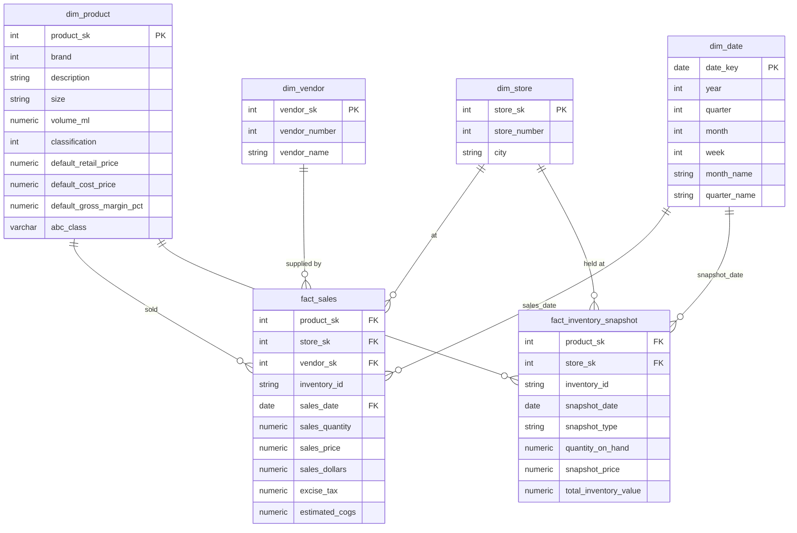

[](README.md)
&nbsp;&nbsp;
[](README.zh-CN.md)


# 庫存績效分析

**PostgreSQL · Power BI · Python · SQL**

---

## 專案概述

本專案以 **PwC × Kaggle 庫存分析案例**（約 1,280 萬筆銷售交易）的真實資料集，分析一家多門市酒類零售商 2016 年全年的庫存績效。原始 CSV 資料透過 Python ELT Loader 載入 **PostgreSQL**，經三層架構清洗（raw → staging → marts），最終於三頁互動式 **Power BI** 儀表板中呈現。

目標是透過結構化維度建模、ABC 分類與 KPI 分析，為**庫存優化、死庫存減少與補貨規劃**提供數據驅動的決策支援。

### 專案範圍

- 透過 Python（`psycopg2`）將 6 個原始 CSV 檔（合計約 1,280 萬筆）載入 PostgreSQL
- 執行完整 ELT 流程：raw（全 TEXT 型態）→ staging（型別轉換、標準化）→ marts（星型結構）
- 建立星型結構（`dim_product`、`dim_store`、`dim_vendor`、`dim_date` → `fact_sales` + `fact_inventory_snapshot`）
- 在 PostgreSQL 以視窗函數實作**靜態 ABC 分類**，避免 Power BI Import Mode 處理 1,200 萬筆時的計算逾時
- 計算 5 個庫存 KPI：Inventory Turnover、DSI、Stockout Rate、Dead Stock %、Reorder Point
- 在 **Power BI**（Import Mode）建立 3 頁互動式儀表板
- 業務洞察與可執行建議

---

## 資料集

| 項目 | 說明 |
|---|---|
| 來源 | PwC × Kaggle — [Inventory Analysis Case Study](https://www.kaggle.com/bhanupratapbiswas/inventory-analysis-case-study) |
| 完整銷售檔案 | [SalesFINAL12312016.csv](https://www.pwc.com/us/en/careers/university_relations/data_analytics_cases_studies/SalesFINAL12312016csv.zip)（12,825,363 筆 — 需另行下載） |
| 各表筆數 | 銷售：12,825,363 / 進貨：2,372,474 / 期初庫存：206,529 / 期末庫存：224,489 |
| 時間範圍 | 2016 年全年（2016-01-01 至 2016-12-31） |
| 門市數量 | 80 家門市，分佈於多個城市 |
| 商品（SKU）數量 | `dim_product` 中 12,261 個唯一品牌 |
| 供應商數量 | `dim_vendor` 中 132 家供應商 |
| 主要欄位 | inventory_id、brand、description、size、store、city、sales_date、sales_quantity、sales_dollars、on_hand、purchase_price |

---

## 工具與技術

| 工具 | 用途 |
|---|---|
| Python（`psycopg2`、`pandas`、`python-dotenv`） | ELT 原始資料載入 — CSV → PostgreSQL `raw` schema |
| PostgreSQL（標準 SQL） | 三層 ELT、星型結構、KPI 計算、ABC 分類 |
| Power BI（Import Mode） | 互動式儀表板與 KPI 視覺化 |
| GitHub | 版本控管與作品集文件 |

---

## 1. ELT 流程

### 第一層 — 原始資料載入（`scripts/01_load_raw.py`）

- 將全部 6 個 CSV 檔以**全 TEXT 型態**載入 `raw` schema
- 完整保留原始資料，載入時不做任何轉換
- 使用 `psycopg2` 的 `COPY` 指令進行高效能批次匯入

### 第二層 — Staging 轉換（`sql/03_staging_transform.sql`）

**防禦性轉型策略** — 每個欄位均使用雙重 `NULLIF` 防護：

```sql
CAST(NULLIF(NULLIF(TRIM(sales_quantity), ''), 'Unknown') AS NUMERIC(10,2))
```

| 清洗操作 | 說明 |
|---|---|
| 型別轉換 | 全部 TEXT → 適當型別（NUMERIC、DATE、INTEGER） |
| NULL 標準化 | 空字串與 `'Unknown'` 值 → NULL |
| 供應商名稱去空白 | `TRIM(vendor_name)` — 移除來源資料中的尾端空白 |
| 毛利率計算 | `(retail_price - purchase_price) / retail_price * 100`，於 staging 層衍生 |
| 跨年發票標記 | `is_carryover_invoice = TRUE`（invoice_date > 2016-12-31 者） |
| 載入後筆數稽核 | 每次 INSERT 後與 raw 層比對筆數 |

### 第三層 — Marts（星型結構）（`sql/04_marts_star_schema.sql`）

---

## 2. 資料模型（PostgreSQL — 星型結構）

### Schema 圖



### 資料表說明

| 資料表 | 類型 | 說明 | 設計備注 |
|---|---|---|---|
| `dim_product` | 維度 | 12,261 個唯一 SKU，含品牌、描述、規格、定價 | `abc_class` 建立時為 NULL，於 `fact_sales` 建立後透過 CTE UPDATE 回填 |
| `dim_store` | 維度 | 80 家門市及城市名稱 | 城市來源為期初/期末庫存；銷售資料表無城市欄位 |
| `dim_vendor` | 維度 | 從 4 張來源表整合的 132 家供應商 | 由進貨、銷售、發票、進貨價格 UNION 而成。**僅連結 `fact_sales`** — `fact_inventory_snapshot` 以門市 × 商品 × 日期為粒度，設計上不含 `vendor_sk`。已從所有 Power BI 儀表板交叉篩選器排除；供應商層級採購分析規劃為未來功能。 |
| `dim_date` | 維度 | 完整 2016 年曆（366 天） | 衍生年/季/月/週欄位，供 Power BI 交叉篩選使用 |
| `fact_sales` | 事實 | 12,825,363 筆銷售交易 | `estimated_cogs = sales_quantity × default_cost_price` |
| `fact_inventory_snapshot` | 事實 | 期初 + 期末快照（共 431,018 筆） | 兩種 `snapshot_type` 可於單一資料表計算 Turnover/DSI |

---

## 3. ABC 分類設計

> **作品集亮點 — 解決真實工程限制**

**問題：** Power BI 在 Import Mode 下無法有效對 1,200 萬筆資料計算累計 ABC 分類。DAX `RANKX` + 累計 `CALCULATE` 在 SKU 層級會導致報表重新整理逾時。

**解決方案 — PostgreSQL 靜態 ABC（兩階段作法）：**

```sql
-- 階段 A：彙總每個商品的營收
-- 階段 B：以視窗函數計算累計百分比
-- 階段 C：指定 A/B/C 標籤
-- 階段 D：單次 UPDATE 回寫至 dim_product

WITH product_revenue AS (
    SELECT product_sk, SUM(sales_dollars) AS total_sales_dollars
    FROM marts.fact_sales GROUP BY product_sk
),
running_total AS (
    SELECT product_sk,
        ROUND(100.0 * SUM(total_sales_dollars) OVER (ORDER BY total_sales_dollars DESC
              ROWS BETWEEN UNBOUNDED PRECEDING AND CURRENT ROW)
              / NULLIF(SUM(total_sales_dollars) OVER (), 0), 4) AS cumulative_pct
    FROM product_revenue
),
abc_labels AS (
    SELECT product_sk,
        CASE WHEN cumulative_pct <= 80 THEN 'A'
             WHEN cumulative_pct <= 95 THEN 'B'
             ELSE 'C' END AS abc_class
    FROM running_total
)
UPDATE marts.dim_product dp
SET abc_class = al.abc_class
FROM abc_labels al WHERE dp.product_sk = al.product_sk;
```

| 類別 | 門檻 | 實際 SKU 數量 | 實際 SKU 佔比 | 營收貢獻 |
|---|---|---|---|---|
| A | 累計 ≤ 80% | 1,575 | 12.85% | 80% |
| B | 累計 ≤ 95% | 2,101 | 17.14% | 15% |
| C | 累計 > 95% | 7,561 | 61.67% | 5% |
| 未分類（無銷售） | — | 1,024 | 8.35% | — |

---

## 4. KPI 定義與結果

### KPI 公式

| KPI | 公式 | 來源資料表 |
|---|---|---|
| **庫存週轉率（Inventory Turnover）** | `COGS / ((期初庫存價值 + 期末庫存價值) / 2)` | `fact_sales`、`fact_inventory_snapshot` |
| **庫存天數（DSI）** | `365 / Inventory Turnover` | 衍生值 |
| **缺貨率（Stockout Rate）** | `期末庫存量 = 0 的 SKU-門市組合數 / 總 SKU-門市組合數` | `fact_inventory_snapshot` |
| **死庫存率（Dead Stock %）** | `期末庫存量 > 0 且 2016 年零銷售的 SKU-門市數 / 總庫存位置數` | `fact_inventory_snapshot`、`fact_sales` |
| **毛利率（Gross Margin %）** | `(零售價 − 成本價) / 零售價 × 100` | `dim_product` |

### KPI 摘要（2016 年全年）

| KPI | 數值 | 基準 |
|---|---|---|
| 總營收 | $452,062,952 | — |
| 總估算成本（COGS） | $313,385,300 | — |
| 庫存週轉率 | **4.24x** | 酒類零售典型值 ~4–6x ✅ |
| 庫存天數（DSI） | **86 天** | 數值越低效率越高 |
| 缺貨率 | **3.22%** | 目標 < 5% ✅ |
| 死庫存率 | **2.56%** | 目標 < 10% ✅ |
| A 類商品平均毛利率 | **31.69%** | — |

---

## 5. SQL 分析流程

| SQL 檔案 | 用途 | 主要操作 |
|---|---|---|
| `00_schema_setup.sql` | Schema 與 raw 表 DDL | 建立 `raw`、`staging`、`marts` schema；所有 raw 欄位為 TEXT |
| `01_raw_columns_check.sql` | 欄位標頭稽核 | 驗證實際欄位名稱是否符合預期 |
| `02_validate_raw.sql` | 7 節原始資料品質稽核 | NULL 檢查、業務規則、日期範圍、重複偵測、參照完整性 |
| `03_staging_transform.sql` | Staging 層 ELT | 防禦性轉型、NULL 標準化、毛利率衍生、筆數稽核 |
| `04_marts_star_schema.sql` | 星型結構 + ABC | 含代理鍵的維度/事實建立；4 階段靜態 ABC 分類 |
| `05_marts_dim_date.sql` | 日期維度 | 含年/季/月/週屬性的完整 2016 年曆 |
| `analysis/A. overview & Inventory Turnover & DSI.sql` | KPI 基準分析 | 資料表筆數、營收摘要、Turnover/DSI 計算 |
| `analysis/B. Stockout Rate & Overstock (Dead Stock).sql` | 庫存健康度 | 各 SKU-門市的缺貨率與死庫存率 |
| `analysis/C. ABC Classification Distribution.sql` | ABC 分佈 | 各 A/B/C 類的 SKU 數量、佔比與平均毛利率 |

### 資料驗證重點（`02_validate_raw.sql`）

| 檢查項目 | 發現結果 |
|---|---|
| NULL 主鍵 | 所有資料表的 `inventory_id` 均無 NULL |
| 負數量 / 負金額 | `raw_sales` 中 0 筆 |
| 價格計算不符（`raw_purchase_prices`） | 12,260 筆零售價 ≠ 進貨價（預期 — 為利潤空間） |
| 超出日期範圍 | 銷售：0 筆超出 2016 年；發票進貨：140 筆跨年（已標記並保留） |
| 參照完整性 | 64,044 筆銷售 inventory_id 不在期初庫存中；50,368 筆不在期末庫存中（年中新上架商品 — 預期正常） |
| 供應商尾端空白 | 發現於 20+ 家供應商；已透過 staging 層 `TRIM(vendor_name)` 修正 |

---

## 6. Power BI 儀表板（3 頁）

### 第 1 頁：管理層總覽


**KPI 卡片（頂部列）**
- **庫存週轉率 — 4.24x**：全年庫存週轉率，計算公式為 COGS ÷ 平均庫存（期初 + 期末 ÷ 2）。酒類零售業基準為 4–6x；結果在健康範圍內。
- **庫存天數（DSI） — 86 天**：衍生自 365 ÷ 庫存週轉率。代表各門市平均持有約 3 個月的庫存。
- **缺貨率 — 3.22%**：期末庫存中，庫存量 = 0 的 SKU-門市位置佔比。低於 5% 目標門檻。
- **死庫存佔總庫存比率 — 1.85%**：過去 90 天無銷售之 SKU 所佔的期末庫存價值比率。門檻標註設定為 5.0%。

**各門市缺貨率（群組直條圖）**
依缺貨率降序排列各門市。門市 46 的缺貨率接近 100%，遠超其他門市，顯示補貨嚴重失常。大多數門市集中在 0–5% 區間，確認整體缺貨率主要由少數異常門市拉高。

**月度營收與 COGS 趨勢（雙折線圖）**
2016 年全年月度趨勢，並排顯示總營收（藍綠色）與總 COGS（橘色）。營收高峰在 7 月（約 $4,900 萬）與 12 月（約 $5,200 萬），全年低點在 2 月（約 $2,900 萬）。兩線間的穩定差距反映全年 12 個月毛利率保持穩定。

**各 ABC 類別死庫存（水平長條圖）**
比較各 ABC 類別的死庫存價值（90 天）。C 類最高約 $100 萬，其次為未分類約 $50 萬，B 類極少。確認滯銷長尾 SKU 是庫存資金積壓的主要來源。

**各門市 ABC / 未分類分段績效（矩陣）**
可下鑽矩陣，列：門市編號 → ABC 類別顯示。欄：總營收、期末庫存價值、庫存週轉率、庫存天數（DSI）、缺貨率。條件格式標示績效不佳的儲存格（例如：門市 76 未分類顯示 DSI = 232 天（橘色標示）、缺貨率 = 25.53%）。可快速識別哪些門市-分段組合需要立即關注。

### 第 2 頁：庫存風險分析


**KPI 卡片（頂部列）**
- **死庫存價值（90 天） — $1.47M**：過去 90 天（2016 年 10–12 月）無銷售之 SKU-門市位置的期末庫存總價值。
- **死庫存 SKU 數量 — 591**：所有門市中被標記為死庫存的不重複 SKU 數量。
- **缺貨記錄數 — 13K**：期末庫存快照中庫存量 ≤ 0 的記錄數，代表已確認的缺貨位置。
  > **注意 — SQL 分析與 Power BI 儀表板的死庫存定義不同：**
  > 第 7 節「關鍵發現」中的 SQL 分析報告**5,755 個位置 / 77,785 個單位**的死庫存，定義為**2016 年全年零銷售**的 SKU-門市位置（針對 `fact_sales` + `fact_inventory_snapshot` 的靜態查詢）。
  > Power BI KPI 卡片報告**$1.47M / 591 個 SKU**，定義為**過去 90 天（僅 2016 年 10–12 月）零銷售**的位置 — 這是一個滾動 DAX 量值，設計上用於呈現可執行的近期清貨候選名單。
  > 兩個指標均正確；它們回答不同的業務問題：SQL = 全年曝險稽核；Power BI = 可執行的 90 天清貨清單。

**缺貨率 vs 死庫存率 — 門市風險象限（散點圖）**
每個氣泡代表一家門市；氣泡大小代表期末庫存價值。X 軸 = 缺貨率；Y 軸 = 死庫存佔總庫存比率。參考線將圖表分為四個象限（垂直線：缺貨率 = 5%；水平線：死庫存率 = 3%）。右上角象限的門市同時面臨高缺貨率與高死庫存 — 管理風險最為嚴峻。大多數門市集中在左下角（健康區），少數異常門市在上方區域需要針對性介入。

**各門市死庫存價值（90 天）（水平長條圖）**
依死庫存曝險排名門市。門市 50 最高（約 $52 萬），其次為門市 69（約 $44 萬）與門市 34（約 $42 萬）。前 5 家門市佔總死庫存價值的不成比例份額，可針對性執行降價或清貨決策。

**風險明細表**
依死庫存價值降序排列的逐筆明細。欄位：門市編號、品牌、ABC 類別顯示、現有庫存量、過去 90 天銷售量、死庫存價值（90 天）、庫存狀態、庫存記錄狀態、SKU 生命週期狀態。
- **庫存狀態**（🟠 死庫存 / 🔴 缺貨 / 🟢 健康）— 標記每個位置的風險類別。
- **庫存記錄狀態**（有快照 / ⚠️ 無快照但有銷售）— 識別有銷售記錄但無期末庫存記錄的資料缺口。
- **SKU 生命週期狀態**（穩定 / 新上架 / 已售完）— 根據期初 vs 期末快照模式分類每個品牌-門市組合。
  頂部列顯示門市 50、76、34、69 的 B/C 類 SKU，每個位置的死庫存價值約 $1 萬至 $2 萬。

### 第 3 頁：補貨與 ABC 優先排序


**KPI 卡片（頂部列）**
- **需補貨 SKU 數量 — 2,639**：目前庫存量等於或低於再訂購點（補貨警示 = "🟡 立即補貨"）的不重複 SKU 總數，需立即執行補貨。
- **每日平均銷售量 — 89,940 個**：全品項平均每日銷售單位數，作為再訂購點與安全庫存計算的需求輸入值。
- **期末庫存價值 — $79.70M**：所有門市的期末庫存總價值，提供庫存風險規模的背景參考。

**各品牌庫存量 vs 再訂購點差距（水平長條圖）**
繪製各門市-品牌組合的現有庫存量減去再訂購點數量。正值（零右側）代表有足夠緩衝；負值（零左側）代表庫存已低於再訂購門檻。門市 46、品牌 381 的正向差距最大（約 +250K），而左側多個品牌的負向差距需要緊急處理。Y 軸顯示門市編號，可進行門市層級下鑽。

**各 ABC 類別需補貨 SKU 數量（群組直條圖）**
比較各 ABC 類別中需要補貨的 SKU 數量。C 類最多（2,500+ 個 SKU），反映龐大的長尾商品目錄。B 類與 A 類需補貨的 SKU 明顯較少，與其較高的周轉速度和更主動的補貨管理一致。突顯長尾 C 類庫存管理是主要的運營負擔。

**補貨優先順序矩陣 — 依緊急程度排序（矩陣）**
可下鑽矩陣，層級：ABC 優先群組 → 品牌 → 門市編號。依補貨警示緊急程度排序（缺貨 → 立即補貨 → 低庫存 → 正常）。欄位：現有庫存量、每日平均銷售量、安全庫存量、再訂購點數量、補貨警示、剩餘庫存天數、庫存 vs 再訂購點差距。
頂部列顯示品牌 381（A-Critical）跨多家門市，全部標記為 🔴 缺貨，現有庫存量 = 0.00，剩餘庫存天數 = 0.00，庫存 vs 再訂購點差距介於 −19 至 −51 — 確認這些為最高優先補貨行動。
庫存 vs 再訂購點差距的條件格式將負值以紅色顯示，以快速識別最嚴重的短缺情況。

> **設計備注 — `dim_vendor` 未納入儀表板交叉篩選器：**
> `dim_vendor` 已在 PostgreSQL 與 Power BI 中建模並連結至 `fact_sales`。
> 然而，5 個庫存 KPI（庫存週轉率、DSI、缺貨率、死庫存率、再訂購點）均衍生自 `fact_inventory_snapshot`，該表以**門市 × 商品 × 日期**為粒度記錄庫存位置，設計上不含 `vendor_sk`。
> 供應商交叉篩選器對庫存導向頁面無效 — 此排除為刻意設計，非遺漏。供應商層級採購分析規劃為未來功能。

儀表板 PDF 匯出：[`powerbi/dashboard.pdf`](./powerbi/dashboard.pdf)

---

## 關鍵發現

### 庫存 KPI

| 指標 | 數值 | 洞察 |
|---|---|---|
| 庫存週轉率 | 4.24x | 在酒類零售業基準範圍內（4–6x）；仍有改善空間 |
| 庫存天數（DSI） | 86 天 | 約 3 個月庫存；C 類 SKU 可能是拉高數值的主因 |
| 缺貨率 | 3.22% | 低於 5% 目標 — 整體供貨覆蓋健康 |
| 死庫存率 | 2.56% | 5,755 個位置 / 77,785 個單位 **2016 年全年零銷售**（SQL 靜態稽核）。Power BI 儀表板以**滾動 90 天視窗**報告 $1.47M / 591 個 SKU — 詳見第 6 節第 2 頁備注。 |

### ABC 分類

| 類別 | SKU 數量 | SKU 佔比 | 營收貢獻 |
|---|---|---|---|
| A | 1,575 | 12.85% | 80% |
| B | 2,101 | 17.14% | 15% |
| C | 7,561 | 61.67% | 5% |
| 未分類 | 1,024 | 8.35% | — |

*資料來源：`output/analysis/C1.csv`*

### 前 5 大營收商品（A 類）

| 排名 | 商品 | 營收 | 平均售價 |
|---|---|---|---|
| 1 | Jack Daniels No 7 Black | $5,101,920 | $36.23 |
| 2 | Tito's Handmade Vodka | $4,819,073 | $30.31 |
| 3 | Absolut 80 Proof | $4,538,121 | $24.48 |
| 4 | Capt Morgan Spiced Rum | $4,475,973 | $22.83 |
| 5 | Ketel One Vodka | $4,223,108 | $31.42 |

*資料來源：`output/analysis/C2.csv`*

### 庫存價值變動（2016 年）

| 指標 | 數值 | 意涵 |
|---|---|---|
| 期初庫存價值 | $68,053,780 | 2016 年 1 月開始庫存位置 |
| 期末庫存價值 | $79,704,851 | 2016 年 12 月結束庫存位置 |
| 庫存增長 | **+$11,651,071（+17.1%）** | 庫存增速超過銷售增速 — 過度採購訊號 |
| 總 COGS | $313,385,300 | 1,280 萬筆交易的估算銷售成本 |
| 總銷售營收 | $452,062,952 | 2016 年全年淨營收 |

*資料來源：`output/analysis/A3.csv`*

> 儘管沒有等幅需求增長的證據，期末庫存全年增長 17.1%。這種失衡在 C 類 SKU 中最為明顯，該類別佔商品目錄的 61.67%，但僅貢獻 5% 的營收。

### 缺貨與死庫存明細

| 指標 | 數量 | 比率 | 備注 |
|---|---|---|---|
| 期末庫存 SKU-門市總位置數 | 224,489 | — | `fact_inventory_snapshot` ENDING 列的粒度 |
| 缺貨位置（庫存量 = 0） | 7,230 | **3.22%** | 低於 5% 目標 ✅ |
| 死庫存位置（2016 年全年零銷售） | 5,755 | **2.56%** | 77,785 個積壓庫存單位 |
| 死庫存單位數 | 77,785 | — | 無需求訊號下積壓的資本 |

*資料來源：`output/analysis/B2.csv`*

---

## 業務建議

1. **保障 A 類 SKU 可用性 — 尤其是前 5 大商品** — 1,575 個 SKU（佔商品目錄 12.85%）創造 $4.52 億營收的 80%。Jack Daniels No 7（$510 萬）與 Tito's Vodka（$482 萬）各自佔總營收逾 2%。以 2016 年週銷售速度估算，Jack Daniels No 7 單週缺貨即損失約 $9.8 萬銷售；Tito's Handmade Vodka 再加 $9.3 萬 — 合計每週風險約 $19.1 萬。建議以 2 倍平均週銷量設置自動補貨觸發點。

2. **將 DSI 從 86 天降至 60–70 天目標區間** — 目前 86 天的 DSI 高於酒類零售效率目標。期末庫存達 $7,970 萬（較期初增加 17.1%），庫存增速超越銷售增速。建議重點削減對 7,561 個 C 類 SKU 的採購訂單，該類別僅貢獻 5% 營收卻佔商品目錄的 61.67%。

3. **分析季節性需求並在銷售旺季前提前備貨** — 12 月（$5,230 萬）與 7 月（$4,970 萬）是全年最高營收月份，合計佔全年銷售 22.6%。2 月（$2,890 萬）為全年低點。A 類 SKU 在 11 月與 6 月提前備貨、C 類商品在 1 月暫停採購，可在保障旺季供應的同時降低 DSI。

4. **在門市層級監控 3.22% 的缺貨率** — 儘管整體比率在目標範圍內，Doncaster 的門市 #76 與 #73（分別以 $2,550 萬與 $2,170 萬排名前 2）一旦缺貨，影響可能不成比例。Power BI 庫存健康頁面的門市層級下鑽功能可支援針對性補貨優先排序。

5. **在 $1,170 萬庫存積壓演變為死庫存前予以處理** — 2016 年全年期末庫存從 $6,810 萬增至 $7,970 萬（+17.1%），而總銷售量為 3,290 萬個單位。7,561 個 C 類 SKU 僅貢獻 5% 營收，卻佔據長尾商品目錄的大多數。對 2016 年 Q4 完全未售出的 C 類 SKU 末端 20%（依銷售速度排列）執行採購凍結，可防止目前 2.56% 的死庫存率在 2017 年進一步惡化。

6. **透過針對性降價將 77,785 個死庫存單位轉化為流動資金** — 5,755 個 SKU-門市位置在 2016 年全年零銷售，代表無需求訊號的積壓單位。依 ABC 類別優先清貨：先清 C 類死庫存（機會成本最低），再處理未分類商品（無 ABC 營收基準）。A/B 類死庫存位置雖然較少，在降價前應先考慮門市調撥 — 在門市 50 賣不出去的商品，在門市 73 可能仍有需求。

---

## 資料工程備注

### 處理 1,280 萬筆銷售檔案

完整的 `SalesFINAL12312016.csv` 包含 **12,825,363 筆**，但標準工具（Excel、pgAdmin 匯入精靈）上限約為 100 萬筆。本專案透過 Python `psycopg2` 批次載入器搭配分塊讀取解決此問題：

```python
# scripts/01_load_raw.py
for chunk in pd.read_csv(filepath, chunksize=100_000, dtype=str):
    # 直接串流寫入 PostgreSQL raw schema
```

完整檔案須從 [PwC 來源](https://www.pwc.com/us/en/careers/university_relations/data_analytics_cases_studies/SalesFINAL12312016csv.zip) 下載，並放置於 `data/raw/` 後再執行載入程式。

---

## 如何重現

**前置條件**：Python 3.8+、PostgreSQL 14+、Power BI Desktop

1. 從 [Kaggle](https://www.kaggle.com/bhanupratapbiswas/inventory-analysis-case-study) 下載原始資料檔案 + [PwC 完整銷售檔案](https://www.pwc.com/us/en/careers/university_relations/data_analytics_cases_studies/SalesFINAL12312016csv.zip)，放置於 `data/raw/`
2. 安裝相依套件
   ```bash
   pip install pandas sqlalchemy psycopg2-binary python-dotenv
   ```
3. 設定資料庫連線
   ```bash
   cp .env.example .env
   # 編輯 .env 填入您的 PostgreSQL 認證資訊
   ```
4. 依序執行 ELT 流程：
   ```bash
   # 步驟 1：建立 schema 與 raw 資料表
   psql -f sql/00_schema_setup.sql

   # 步驟 2：將原始 CSV 載入 PostgreSQL
   python scripts/01_load_raw.py

   # 步驟 3：驗證原始資料
   psql -f sql/02_validate_raw.sql

   # 步驟 4：Staging 轉換
   psql -f sql/03_staging_transform.sql

   # 步驟 5：建立星型結構 + ABC 分類
   psql -f sql/04_marts_star_schema.sql

   # 步驟 6：建立日期維度
   psql -f sql/05_marts_dim_date.sql
   ```
5. 執行 KPI 分析查詢（選擇性 — 輸出結果已存於 `output/analysis/`）：
   ```bash
   psql -f "sql/analysis/A. overview & Inventory Turnover & DSI.sql"
   psql -f "sql/analysis/B. Stockout Rate & Overstock (Dead Stock).sql"
   psql -f "sql/analysis/C. ABC Classification Distribution.sql"
   ```
6. 開啟 Power BI Desktop，連線至 PostgreSQL `marts` schema，重新整理資料

---

## 專案結構
```
04_Inventory_Performance_Analysis/
├── README.md
├── data/
│ ├── raw/ # 完整 CSV（已 gitignore — 不提交）
│ └── raw_review/ # 各來源檔案的 100 列預覽
├── scripts/
│ └── 01_load_raw.py # Python 批次載入器（CSV → raw schema）
├── sql/
│ ├── 00_schema_setup.sql # Schema 建立與 raw 資料表 DDL
│ ├── 01_raw_columns_check.sql # 欄位標頭稽核
│ ├── 02_validate_raw.sql # 7 節原始資料驗證
│ ├── 03_staging_transform.sql # Staging ELT（型別轉換、NULL 處理）
│ ├── 04_marts_star_schema.sql # 星型結構 + 靜態 ABC 分類
│ ├── 05_marts_dim_date.sql # 日期維度
│ └── analysis/ # KPI 與業務分析查詢
├── output/
│ ├── mart_review/ # mart 資料表的 100 列預覽
│ ├── sql.02_validate_raw/ # 驗證查詢輸出（CSV）
│ └── analysis/ # KPI 分析查詢輸出（CSV）
├── powerbi/
│ ├── dashboard.pdf # 儀表板 PDF 匯出
│ └── screenshots/ # Page1.png / Page2.png / Page3.png
├── powerbi_design.ipynb # Power BI 設計規格與 DAX
├── log.ipynb # 開發日誌與工程決策
├── .env.example # 資料庫連線範本
└── LICENSE
```

---

## 作者

Ross Tang | [GitHub](https://github.com/ross-bi)

## 授權條款

本專案採用 [MIT 授權條款](./LICENSE)。